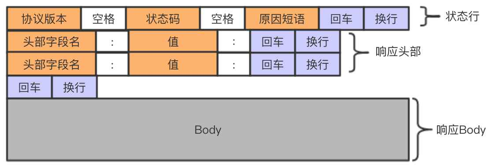

# 第2章 应用层

## 2.1 应用层协议原理

研发网络应用程序的核心是写出能够运行在不同的端系统和通过网络彼此通信的程序。

### 2.1.1 网络应用程序体系结构

从应用程序开发者的角度看，网络体系结构是固定的，并为应用程序提供了特定的服务集合。

#### 客户-服务器体系结构（client-server architecture）

* 有一个总是打开的主机称之为**服务器**向其他的被称为**客户**的主机提供服务。客户发起请求，服务器返回响应。
* 客户之间不直接通信。
* 服务器有固定的、周知的地址，称为IP地址。

单独的服务器通常不能满足所有客户请求，为此，配备大量主机的**数据中心**常被用于创建强大的虚拟服务器。

#### P2P体系结构（P2P architecture）

在P2P结构中，对位于数据中心的专用服务器有最小的（或者没有）依赖。相反，应用程序在间断连接的**主机对**之间直接使用通信，这些主机被称为**对等方**。

P2P体系结构最吸引人的特性之一是它的**自扩展性**。比如对于一个对等方而言，请求服务为网络整体增加了负担，但同时每个对等方返回响应也为网络增加服务能力。

### 2.1.2 进程通信

用操作系统的术语来说，进行通信的实际上是**进程**而不是程序。

在两个不同端系统上的进程，通过跨越计算机网络交换**报文**而相互通信。

#### 1. 客户和服务器进程

网络应用程序由成对的进程组成，这些进程通过网络相互发送报文。
没对通信进程，我们通常将者两个进程中的一个标识为客户，另一个标识为服务器。

我们定义客户和服务器进程如下：

>在一对进程之间的通信会话场景中，发起通信（即在该会话开始时发起与其他进程联系）的进程被标识为**客户**，在会话开始时等待联系的进程是**服务器**。

#### 2. 进程与计算机网络之间的接口

进程通过一个称为套接字的软件接口向网络发送报文和从网络接收报文。

#### 3. 进程寻址

接收进程需要有一个地址。

为了标识该接收进程，需要定义两种信息：

1. 主机的地址
   * 在因特网中，主机由其**IP地址**标识。
2. 在目的主机中指定接收进程的标识符
   * 目的地端口号用于这个目的。

### 2.1.3 可供应用程序使用的运输服务

一个运输层协议能够为调用它的应用程序提供什么样的服务呢？

我们大体能够从四个方面对应用程序服务要求进行分类：可靠数据传输、吞吐量、定时和安全性。

#### 1. 可靠数据传输

分组在计算机网络中可能丢失，因此，必须做一些工作以确保由应用程序的一端发送的数据正确、完全的交付给该应用程序的另一端。这就是**可靠数据传输**。

当一个运输层协议不能提供可靠数据传输时，这或许能被**容忍丢失的应用**所接收。比如在视频中有微小的干扰，这并非致命的损伤。

#### 2. 吞吐量

具有吞吐量要求的应用程序被称为**带宽敏感的应用**。比如因特网电话。

**弹性应用**则能够根据当时可用的贷款或多或少的利用可供使用的吞吐量。

#### 3. 定时

就是对延时做了规范

#### 4. 安全性

运输协议可以为应用程序提供一种或多种安全性服务。

### 2.1.4 因特网提供的运输服务

分为UDP和TCP

#### 1. TCP服务

TCP服务模型包括面向连接服务和可靠数据传输服务。

* **面向连接服务**：在应用层数据报文开始流动*之前*，TCP让客户和服务器互相交换运输层控制信息。这个所谓的握手过程提醒用户和服务器，让它们为大连分组的到来做好准备。在握手阶段后，一个**TCP连接**就在连个进程的套接字之间建立了。这条连接是全双工的，即连接双方的进程可以在此连接上同时进行报文收发。当应用程序结束报文发送时，必须拆除该连接。
* **可靠的数据传输服务**：通信进程能够依靠TCP，无差错、按适当顺序交付所有发送的数据。当应用程序的一端将字节流传进套接字时，它能够依靠TCP将相同的字节流交付给接收方的套接字，而没有字节的丢失和冗余。

TCP提供拥塞控制机制。

TCP可以使用SSL来提供安全服务。

#### 2. UDP服务

UDP是一种不提供不必要服务的轻量级运输协议，它仅提供最小服务。

UDP是无连接的，因此两个进程通信前没有握手过程。

UDP协议提供一种不可靠数据传送服务。

也就是说UDP不保证数据一定能传输到，即使传输到了，也有可能是乱序的，除此之外，UDP也没有拥塞控制机制。

#### 3. 因特网运输协议所不提供的服务

目前因特网运输协议中并没有提供吞吐量或定时的保证。

但我们仍能提供令人满意的服务，这是因为如因特网通话这样的应用在设计时就尽可能的应对了这种缺乏。

### 2.1.5 应用层协议

应用层协议定义了运行在不同端系统上的应用进程如何相互传递报文。特别是应用层协议定义了：

* 交换的报文类型，例如亲求报文和响应报文。
* 各种报文类型的语法，如报文中的各个字段及这些字段是如何描述的。
* 字段的语义，即这些字段中的信息的含义。
* 确定一个进程何时以及如何发送报文，对报文进行响应的规则。

有些应用层协议是由RFC文档定义的，如HTTP。

### 2.1.6 本书涉及的网络应用

Web、文件传输、电子邮件、目录服务、流式视频和P2P。

## 2.2 Web和Http

### 2.2.1 HTTP概况

HTTP是超文本传输协议(HyperText Transfer Protocol)，是Web的核心。

HTTP由两个程序实现：一个客户程序和一个服务器程序。HTTP定义了客户和服务器之间报文交换的方式。

Web页面由对象组成。一个**对象**就是一个文件，如图片，视频等。多数Web页面含有一个**HTML基本文件**。

HTML基本文件通过URL地址引用页面中的其他对象。每个URL分为两个部分：存放对象的服务器主机名和路径名。

Web浏览器就是常见的客户。

Web服务器实现了HTTP服务器端，用于存储Web对象。

HTTP定义了Web客户向Web服务器请求Web页面的方式，以及服务器向客户传送Web页面的方式。

HTTP使用TCP作为它的支撑运输协议。

客户和服务器通过套接字将报文从应用层传输到运输层。经过套接字后，发出报文的一端将报文的控制交给TCP，而接收报文的一端将控制权从TCP中接过。

服务器向客户发送被请求的文件，而不存储任何关于该客户的状态信息。所以我们说HTTP是一个**无状态协议**。假如某客户短时间内连续请求同一对象，服务器不会因为之前刚刚提供过这个对象而不做反应，而是重新发送该对象，就好像完全忘记之前做过的事一样。

### 2.2.2 非持续连接和持续连接

客户可能在一段时间内发出多个请求。

若每一个请求都经一个**单独**的TCP连接发送，则此应用程序使用**非持续连接**。

若这些请求都经**相同**的TCP连接发送，则称此应用程序使用**持续连接**。

在HTTP中默认使用持续连接。

#### 1. 采用非持续连接的HTTP

缺点：

1. 需要大量的TCP连接数，给服务器带来负担。
2. 每个对象都要经过三次握手，造成时延。

#### 2. 采用持续连接的HTTP

没什么特别的缺点。

### 2.2.3 HTTP报文格式

#### 1. HTTP请求报文

如下提供了一种典型的HTTP请求报文：

> GET /somedir/page.html HTTP/1.1</br>
> Host: www.someschool.edu</br>
> User-agent: Mozilla/5.0</br>
> Accept-language: fr

请求报文格式：

```xml
<method> <request-UTL> <version>
<headers>
<entity-body>
```


#### 2. HTTP响应报文

> HTTP/1.1 200 OK</br>
> Connection: close</br>
> Date: Tue, 18 Aug 2015 15:44:04 GMT</br>
> Server: Apache/2.2.3 (CentOS)</br>
> Last-Modified: Tue, 18 Aug 2015 15:11:03 GMT</br>
> Content-Length: 6821</br>
> Content-Type: text/html</br>
>
> (data data data data data ...)



### 2.2.4 用户与服务器交互：cookie

Web站点用以识别用户的方法。

cookie技术有4个组件：

1. 在HTTP响应报文中的一个cookie首部行
2. 在HTTP请求报文中的一个cookie首部行
3. 在用户端系统中保留有一个cookie文件，并由用户的浏览器进行管理
4. 位于Web站点的一个后端数据库。


流程解释：

1. 第一次发起请求时，服务器会返回一个头，set-cookie: 0000
2. 浏览器将cookie设置到本地
3. 之后再发起请求就会使用之前设置好的cookie

### 2.2.5 Web缓存

**Web缓存器**也叫**代理服务器**，它是能够代表初始服务器来满足HTTP请求的网络实体。

当用户请求访问时，向代理服务器请求一个对象，若代理服务器没有该对象，将向初始服务器请求这个对象，并在代理服务器中保留副本。

这在客户到缓存器的带宽大于客户到服务器的带宽时，十分有效。

### 2.2.6 条件GET方法

Web缓存器虽然提高响应速度，但存放在缓存器中的对象副本可能时过时的。

不过，HTTP协议有一种机制，允许缓存器证实它的对象时最新的，这就是**条件GET**。

如果：

1. 请求报文使用了GET方法
2. 请求报文中包含一个"If-Modified-Since:"首部行

这就是一个条件GET请求报文。

接下来看一个例子：

* 首先有一个代理服务器，代表一个请求浏览器向Web服务器发送一个请求报文：

> GET /fruit/kiwi.gif HTTP/1.1</br>
> Host: www.exotiquecuisine.com

* 然后Web服务器向缓存器发送响应报文：

> HTTP/1.1 200 OK</br>
> Date: Sat, 3 Oct 2015 15:39:29</br>
> Server: Apache/1.3.0 (Unix)</br>
> Last-Modified: Wed, 9 Sep 2015 09:23:24</br>
> Content-Type: image/gif</br>
>
> (data data data data data data ...)

* 之后缓存器会将对象转发给浏览器，同时在本地缓存了该对象。同时保留了该对象的最后修改日期。

* 一周后，当有用户再次请求这个对象时，由于对象可能被修改，因此缓存器将发送一个条件GET执行最新检查。

> GET /fruit/kiwi.gif HTTP/1.1</br>
> Host: www.exotiquecuisine.com</br>
> If-Modified-Since: Wed, 9 Sep 2015 09:23:24

* 如果没有修改，则Web服务器返回：

> HTTP/1.1 Not Modified</br>
> Date: Sat, 10 Oct 2015 15:39:29</br>
> Server: Apache/1.3.0 (Unix)</br>
>
> (empty body)

## 2.3 因特网中的电子邮件

电子邮件的总体情况：


可以看出其主要分为**用户代理**、**邮件服务器**和**简单邮件传输协议**。

### 2.3.1 SMTP

SMTP用于从发送方的邮件服务器将报文发送至接收方的邮件服务器。

当Alice向Bob发送电子邮件时：

1. Alice写好邮件，向她的用户代理提供Bob的地址，然后指示用户代理发送报文。
2. 用户代理把报文发给服务器，保存在服务器的报文队列中。
3. 运行在Alice的SMTP客户端发现了这个报文，于是和Bob的SMTP客户端进行TCP连接。
4. 经过一些列SMTP握手后，报文从Aclie服务器发送到了Bob服务器。
5. Bob从他的SMTP服务器获取报文，并在空的时候读一下。

注意到，SMTP之间发送邮件时不会经过中间服务器，即使这两个服务器在地球的两端。如果接收方没有开机，那么邮件会在发送方的队列里等待之后发送。

接下来展示一个SMTP客户和SMTP服务器之间交换报文的例子。客户的主机名为`crepes.fr`，服务器主机名为`hamburger.edu`：

> S: 220 `hamburger.edu`</br>
> C: HELO `crepes.fr`</br>
> S: 250 Hello `crepes.fr`, pleased to meet you</br>
> C: MAIL FROM: `<alice@crepes.fr>`</br>
> S: 250 `alice@crepes.fr` ... Sender ok</br>
> C: RCPT TO: `<bob@hamburger.edu>`</br>
> S: 250 `bob@hamburger.edu` ... Recipent ok</br>
> C: DATA</br>
> S: 345 Enter mail, end with "." on a line by itself</br>
> C: Do you like ketchup?</br>
> C: How about pickles?</br>
> C: .</br>
> S: 250 Message accepted for delivery</br>
> C: QUIT</br>
> S: 221 `hamburger.edu` closing connection</br>

可以在telnet上尝试一下，命令为：`telnet server 25`。

有兴趣可以试一下qq的，请看这个链接：[利用 telnet 命令测试 SMTP 服务（QQ邮箱）](https://blog.csdn.net/cccccout/article/details/105764940?utm_medium=distribute.pc_relevant.none-task-blog-BlogCommendFromMachineLearnPai2-1.nonecase&depth_1-utm_source=distribute.pc_relevant.none-task-blog-BlogCommendFromMachineLearnPai2-1.nonecase)

### 2.3.2 与HTTP对比

HTTP和SMTP都是从一个主机向另一个主机传输对象，HTTP中是从Web服务器传向客户，在SMTP中则是两个服务器之间传输。且在传输文件时两者都使用持续连接。

不过这两者也有十分重要的区别：

1. HTTP主要是一个**拉协议**(pull protocol)，TCP连接由想获取信息的机器发起。而SMTP是一个**推协议**(push protocal)，TCP连接由想发送文件的机器发起。
2. SMTP要求报文采用7比特ASCII码格式。非7比特ASCII字符或二进制部分部分，要按照7比特ASCII码方式重新编码。HTTP则没有这种限制。
3. 如何处理一个既有文本又有多媒体的文档，SMTP将所有对象都放在一个报文内部，而HTTP把每个对象封装在自己的响应报文中。

### 2.3.3 邮件报文格式

报文首部一定有From和To这两个首部行，其他的则不一定。

一个典型的报文看起来如下：

> From: `alice@creper.fr`</br>
> To: `bob@hamburger.edu`</br>
> Subject: Searching the meaning of life

### 2.3.4 邮件访问协议

在20世纪90年代之前，阅读邮件都是在服务器上的阅读软件上完成的，如果要在自己的个人电脑上处理邮件，需要用户代理从SMTP服务器上拉取邮件，但拉取邮件是一个拉操作，而STMP是一个推协议。

因此有这些协议来做拉取邮件的操作。

* 第三版的邮局协议(Post Office Protocol-Version 3, POP3)
* 因特网邮件访问协议(Internet Mail Access Protocol, IMAP)
* HTTP

#### 1. POP3

POP3是一个极为简单的协议，功能很有限。

当用户打开一个到服务器端口110的TCP连接之后，POP3即开始工作。

POP3按照三个阶段进行工作：

1. 特许(authorization)
   * 用户代理以明文发送用户名和密码以验证用户。
2. 事物处理
   * 用户代理取回报文，同时可以对报文做删除标记，取消对报文做删除标记，以及获取邮件的统计信息。
3. 更新
   出现在客户发出quit命令之后，目的是断开POP3会话，这是邮件服务器会删除做了删除标记的邮件。

#### 2. IMAP

在POP3中，用户无法在服务器上为邮件指派文件夹，也就是管理起来不太方便。

在IMAP中，用户可以创建新文件夹，并为邮件做在文件夹间的移动操作。

IMAP的另一个重要特性时允许用户只获取报文的首部，或一个多部分MIME报文中的一部分，这在带宽不足的情况下十分有用。

#### 3. 基于Web的电子邮件

就是用了HTTP协议，这种情况下，用户代理就是一个浏览器。

## 2.4 DNS：因特网的目录服务

一台服务器可以用**主机名**(hostname)来标识，但这几乎没有提供这台主机在
因特网中的位置，何况主机名由不定长的数字字母构成，这不利于路由器的处理。因此，主机也可以使用所谓的**IP地址**进行标识。

### 2.4.1 DNS提供的服务

DNS的作用就是将主机名转换成IP地址，因此成为**域名系统**(domain name system)。

DNS是：

1. 一个由分层的**DNS服务器**实现的分布式数据库。
2. 一个使得主机能够查询分布式数据库的应用层协议。

DNS服务器通常是运行BIND(Berkeley Internet Name Domain)软件的UNIX机器。

DNS协议运行在UDP之上，使用53端口。

当我们访问`www.bilibili.com`时：

1. 同一台用户主机上运行着DNS应用客户端。
2. 浏览器从上述URL中抽取出主机名`www.bilibili.com`，并将这台主机名传给DNS应用的客户端。
3. DNS客户向DNS服务器发送一个包含主机名的请求。
4. DNS客户最终会收到一份响应报文其中有对应该主机名的IP地址。
5. 浏览器收到该IP地址，并向该地址发起端口为80的TCP连接。

DNS服务器还提供一些重要服务：

* **主机别名**。有着复杂主机名的主机可以拥有一个或多个别名。一台名为`relay1.west-coast.enterprise.com`的主机可能还有两个别名：`www.enterprise.com`和`enterprise.com`。在这种情况下`relay1.west-coast.enterprise.com`可被成为主机规范名。DNS可以通过别名来找到规范主机名和IP地址。
* **邮件服务器别名**。比如一个叫做bob的人，他的邮箱说`bob@yahoo.com`但主机名可能就十分复杂了。另，MX记录允许一个公司的主机名和邮件服务器名使用相同的（别名化的）主机名。
* **负载分配**。DNS也用于在冗余的服务器之间进行负载分配。繁忙的服务器，被冗余的分布在多台服务器上，每台服务器均运行在多台不同的端系统上，每个都有着不同的IP地址。这些IP集合共享同一个主机名。当客户询问时，DNS以这个IP集合进行响应，但每次循环IP地址的次序。因为客户总是向第一个IP地址发送报文，因此可以实现负载分配。

### 2.4.2 DNS工作机理概述

当客户需要转换主机名时，只需要将之发送给DNS，然后等待DNS返回报文即可。对于客户而言这就是一个转换主机名的黑盒子，但实现这个黑盒子却十分不易。

一种简单的设计是在因特网上只使用一个DNS服务器，该服务器包含所有映射。但对于当今庞大的互联网而言，这种集中式设计的问题包括：

* **单点故障**(a single point of failure)如果该服务器故障，整个因特网将随之瘫痪。
* **通信容量**(traffic volume)这个服务器将要处理所有的查询。
* **远距离的集中式数据库**(distant centralized database)这个服务器不可能同时“邻近”所有查询客户，比如这个服务器在北京，那么远在大洋的客户就要跨过半个地球访问该服务器，也许中间还要经过低速和阻塞的链路。
* **维护**(maintenace)这个服务器需要保存世界上所有的主机名，这将是这个数据库十分庞大。而且，这个数据库必须不断添加新的主机名。

#### 1. 分布式、层次数据库

为了处理扩展性问题，DNS使用了大量的DNS服务器，它们以层级方式组织，并分布在全球各地。

大致来说有三种服务器：根DNS服务器、顶级域(Top-Level Domain, TLD)DNS服务器和权威DNS服务器。

当我们查询一个主机名时，首先与根DNS服务器联系，得到TLD服务器的IP地址，接着从TLD服务器中得到权威DNS服务器IP地址，最后得到某个主机名的IP地址。


* **根DNS服务器**。有400余个根DNS服务器编辑全球。分由13个组织管理，IP及组织都可在[Root Servers 2016]中查到。
* **顶级域(DNS)服务器**。对所有顶级域（如，com, org, net, gov, edu)和所有国家顶级域（如，cn, jp, uk）都有TLD服务器。顶级域列表参见[TLD list 2016]。
* **权威DNS服务器**。

还有一类是**本地DNS服务器**，主要负责代理DNS请求，通常这个服务器是“邻近”或者就在局域网内的。

DNS查询有这样两种：

* 一种是本地DNS服务器向根DNS服务器查询，然后得到顶级域服务器的地址，然后再向顶级域服务器查询，一直查到想要的地址为止。
* 另一种是本地DNS服务器向根DNS服务器查询，由根服务器向顶级域服务器询问，顶级域服务器再向权威服务器询问，之后一层层返回，本地DNS服务器将直接得到根DNS服务器的回答。

#### 2. DNS缓存

DNS服务器会将一些映射保存在本地，也就是缓存。考虑到映射变化，这些缓存通常保留两天。这有利于提高查询速度。

### 2.4.3 DNS记录和报文

所有DNS数据库存储了资源记录(Resource Record, RR)，RR提供了主机名到IP地址的映射。

资源记录是一个包含了下列字段的4元组：

> (Name, Value, Type, TTL)

TTLL是该记录的生存时间，它记录了RR应当从缓存中删除的时间。

我们忽略TTL字段，Name和Value字段的值取决于Type：

* 如果Type=A，则Name为主机名，Value为IP地址。
* 如果Type=NS，则Name是个域（如`foo.com`），而Value是知道如何获得主机名IP地址的权威DNS服务器的主机名。
* 如果Type=CNAME，则Name为别名，Value是别名为Name的主机的规范主机名。
* 如果Type=MX，则Name为别名，Value是别名为Name的邮件服务器的规范主机名。

#### 1. DNS报文

DNS只有查询报文和回答报文这两种，且这两种报文的格式相同。


* 前12个字段为首部区域。
  * 标识符是一个16比特的数，用于标识该查询。
  * 标志字段中由若干标志。1比特的标志为指出这是查询报文（0）还是回答报文（1）。还有是否查询权威DNS名字的“权威的”标志，“希望递归”标志。在回答报文中会有“递归可用”标志。
  * 剩下的就是数量字段。
* 问题区域包含正在查询的信息。
  1. 名字字段，包含正在被查询的主机名字。
  2. 类型字段，指出问题的类型（如，A型）。
* 在DNS服务器的回答中，回答区域包含了最初请求的资源记录。
* 权威区域包含了其他权威服务器的记录。
* 附加区域包含了其他由帮助的记录。例如对于一个MX类型询问，除了返回规范主机名，还会附加这个主机的IP地址。

可以用**nslookup程序**尝试发送DNS报文。

#### 2. 在DNS数据库中插入记录

假如你想注册一个域名，需要在**注册登记机构(registrar)注册**，这是一个商业实体，它保证域名的唯一性，将该域名输入DNS数据库，并收取少量费用。英特网名字和地址分配机构(Internet Corporation for Assigened Names and Numbers, ICANN)向各种注册登记机构授权。可在[
InterNIC](http://www.internic.net/)上找到授权的注册登记机构列表。

注册时需要向机构提供基本和辅助权威DNS服务器名字和IP地址。注册机构将确保一个NS类型和一个A类型的记录输入TLD服务器：
> (别名, 规范名, NS)</br>
> (规范名, IP地址, A)

## 2.5 P2P分发

### 1. P2P体系结构的扩展性

为了将客户-服务器体系结构与P2P体系结构进行比较，阐述P2P的内在自扩展性，我们现在考虑一个用于两种体系结构类型的简单定量模型，将一个文件分发给一个固定对对等方集合。


图中，$d_{i}$为第i对等方下载速度，$u_{i}$为第i对等方上传速度。F为文件长度，N为要分发的文件数量。

**分发时间**为N个文件都被分发完成的时间。

* 首先考虑客户-服务器体系结构的分发时间。
  * 当下载的总速度大于上传总速度，即，$d_{1}+d_{2}+d_{3}+\cdots+d_{N}>u_{1}+u_{2}+u_{3}+\cdots+u_{N}$时，传输完所有文件的限制为上传速度，至少需要$\frac{NF}{u_{s}}$。
  * 当上传总速度大于下载总速度时，即，$u_{1}+u_{2}+u_{3}+\cdots+u_{N}>d_{1}+d_{2}+d_{3}+\cdots+d_{N}$时，传输完所有文件的限制为下载速度，至少需要$\frac{F}{d_{min}}$。
  * 可得这种客户-服务器体系架构的分发时间为:
  * $D_{cs} = max \left\{ \frac{NF}{u_{s}},\frac{F}{d_{min}}\right\}$
  * 可以得知，当对等方数量足够大时，对等方数量增加，分发时间也将线性增加，如果对等方数量扩大1000倍，分发时间也将增加1000倍。

* 接下来分析P2P体系结构。
  * 首先服务器至少发送该文件一次。$\frac{F}{u_{s}}$
  * 分发时间不可能少于某台具体对等方的接收时间。$\frac{F}{d_{min}}$
  * 分发时间受限于网络整体的上传速度。$\frac{NF}{u_{s}+\Sigma^{N}_{i=1}u_{i}}$
  * 得到$D_{P2P}=max \left\{ \frac{F}{u_{s}},\frac{F}{d_{min}},\frac{NF}{u_{s}+\Sigma^{N}_{i=1}u_{i}} \right\}$

### 2. BitTorrent

BitTorrent是一种用于文件分发的流行P2P协议：

* 在BitTorrent中，参与一个特定文件分发的所有对等方的集合被称为一个**洪流**（torrent）。
* 在一个洪流中的对等方彼此下载等长度的文件**块**（chunk），典型的长度为256KB。
* 一个对等方首次加入一个洪流时是没有块的，随着时间流逝，它会积累越来越多的块，它下载块的同时也为其他对等方上载了许多块。
* 一旦某个对等方获得了整个文件，它可以离开洪流，或留在洪流中继续向其他对等方上载块。
* 任何对等方都可以在仅有块的子集时离开洪流，并在以后重新加入该洪流中。
* 每个洪流具有一个基础设施节点，称为追踪器（tracker）。当一个对等方加入洪流时会向追踪器注册自己，并周期性地通知它仍在该洪流中。

接下来看一下具体的例子：

* 当一个新的对等方Alice加入洪流时，追踪器随机地从参与对等方的集合中选择对等方的一个子集（具体起见，设为50个对等方），并将这50个对等方的IP地址发给Alice。
* Alice通过这张对等方列表，尝试与表上的对等方创建TCP连接，连接的成功的对等方为“邻近对等方”。
* 邻近对等方可能会离开，其他对等方可能与Alice创建TCP连接，因此邻近对等方会随时间而变化。
* Alice会周期性地（通过TCP）询问邻近对等方具有的块列表。然后（通过TCP）向当前没有的块发出请求。
* 这里有两个问题需要回答：
  * 她应当向邻居请求那些块？
    * 使用**最稀缺优先**的技术。就是应当请求邻居中最稀缺的块，所谓最稀缺就是邻居中副本最少的块。这样可以（大致地）均衡每个块在洪流中的数量。
  * 她应当响应哪些向她请求块的邻居？
    * Alice根据当前能够以最高速率向她提供数据的邻居给出优先权。每过10秒，Alice确定4个以最高速率流入的邻居，并向其发送块，这个对等方在BitTorrent中被称为**疏通**（unchoked）
    * 且，每过30秒，她也会随机选择一个对等方，称为Bob，向其发送块。这是因为如果Alice向Bob发送的速率够快的话，Bob也会向Alice发送块，如果Bob向Alice发送的速率够快，Bob有可能成为上述4个流入速率最快的邻居之一，并将之前的某个邻居挤掉。
    * 除了这5个对等方，其他对等方均被“阻塞”。

BitTorrent还有一些有趣的机制没有提到，如片（小块）、流水线、随机优先选择、残局模型和反怠慢。刚才描述的关于交换的激励机制常被称为“一报还一报”（tit-for-tat）。

## 2.6 视频流和内容分发网

### 2.6.1 因特网视频

### 2.6.2 HTTP流和DASH

在HTTP流中，所有客户接收到相同编码的视频，尽管不同客户可用的带宽大小有很大不同。

这导致了一种新型基于HTTP流的开发，它常常被称为**经HTTP的动态适应性流**（Dynamic Adaptive Streaming over HTTP, DASH）。

在DASH中，视频编码为几个不同的版本，其中每个版本有不同的比特率。用户可以动态地请求不同编码的视频。

使用DASH后，每个视频版本存储在HTTP服务器中，每个版本都有一个不同的URL。HTTP服务器也有一个**告示文件**，为每个版本提供一个URL及其比特率。用户通过告示分块下载视频，用户在下载块的同时，运行一个速率决定算法，来选择下次请求的块。因此DASH允许用户在不同等级质量之间自由切换。

### 2.6.3 内容分发网

对于一个因特网视频公司，一个简单的做法是直接建立单一的大规模数据中心。但这样就有三个问题：

* 如果客户离数据中心过远，传输延时会很高。
* 流行的视频可能会经过相同的链路发送多次。
* 若这个单一服务器故障，则该公司的服务整个瘫痪。

因此几乎所有主要的视频流公司都使用**内容分发网**（Content Distribution Network）。

CND管理分布在不同地理位置的服务器，在它的服务器中存储数据的副本，并将用户定位到提供最好体验的CDN位置。

CDN可以是**专用CDN**，即它由内容提供商自己所有。或是**第三方CDN**，它代表多个内容分发商分发内容。

CDN通常采用两种不同的服务器安置原则：

* **深入。** 在遍及全球的接入ISP中部署服务器，目的是靠近端用户，因此需要大量服务器。因为这种高度分布式的设计，维护和管理集群的任务成为挑战。
* **邀请做客。** 在少量关键位置建造大集群来 _邀请到ISP做客_ 。不是将集群放在接入ISP中，而放置在因特网交换点。这种方式通常产生较低的维护和管理开销。被许多公司采用。

CDN中不会存储所有的视频副本。一种常见的策略是当用户请求某个视频，而CDN中没有这个视频时，CDN会向中心集群请求，并保留一份副本。当存储空间满时删除一些不常被请求的视频，有点像因特网缓存。

#### 1. CDN操作

当用户想要看某个视频时，会请求某个具体的URL，CDN必须截获该请求，以便能够：

1. 确定此时适合用于该客户的CDN服务器集群;
2. 将客户的请求重定向到该集群的某台服务器。


看到图中第3、4步，权威DNS服务器会将IP地址定位为CDN服务器。

#### 2. 集群选择策略

那么如何选择一个合适的集群呢？这就是**集群选择策略**，即将用户动态的定位到CDN中的某个服务器集群或数据中心的机制。

* 一种简单的策略是指派客户到**地理上最为邻近**的集群。使用商用地理位置数据库就可以实现，数据库中每个LDNS IP都被映射到一个地理位置。这个方法通常很好。但某些情况下，地理位置最近，并非网络路径最近。且有些用户的位置和DNS位置可能差很远。而且在任何情况下都将用户指派到同一个CDN集群，这就很不灵活。
* 还有一种策略，CDN能够对其集群和客户之间的时延和丢包性能执行周期性的**实时测量**。

### 2.6.4 学习案例：Netflix、Youtube和“看看”

#### 1. Netflix

#### 2. Youtube

#### 3. 看看

## 2.7 套接字编程：生成网络应用

网络应用程序分两类。

* 一种是由协议标准所定义的操作的实现。
* 另一种则是专有的网络应用程序。

接下来将使用python3来呈现两队网络应用程序。

### 2.7.1 UDP套接字编程

我们发送一个分组时，要将目的地址附上，目的地址包括目的主机的IP地址和目的套接字的端口号。同时也要将源地址附上，但这一步由底层操作系统自动完成。

我们将实现如下功能：

1. 客户从键盘上读取一行字符，并发送给服务器。
2. 服务器接收该字符串，并转为大写。
3. 服务器将修改后的字符串发送给客户。
4. 客户将之显示在屏幕上。


#### 1. UDPClient

```python

# 该socket模块形成了在Python中所有网络通信的基础
from socket import *

# 这里是"hostname"，可以是IP地址，也可以是主机名
serverName = 'MyServer'
serverPort = 12000
# 下行创建了客户的套接字。
# 第一个参数只是了地址簇；特别是AF_INET指示了底层网络使用IPV4。、
# 第二个参数指示了该套接字是SOCK_DGRAM类型的，这意味着它是一个UDP套接字。
clientSocket = socket(AF_INET, SOCK_DGRAM)
message = input('input lowercase setence:')
clientSocket.sendto(message.encode(), (serverName, serverPort))
# 接收消息和消息源地址
modifiedMessage, serverAddress = clientSocket.recvfrom(2048)
print(modifiedMessage.decode())
clientSocket.close()

```

#### 2. UDPServer

```python

from socket import *

serverPort = 12000
serverSocket = socket(AF_INET, SOCK_DGRAM)
# 这一行代码绑定了端口
serverSocket.bind(('', serverPort))
print("The server is ready to receive")
while True:
    message, clientAddress = serverSocket.recvfrom(2048)
    modifiedMessage = message.decode().upper()
    serverSocket.sendto(modifiedMessage.encode(), clientAddress)

```

### 2.7.2 TCP套接字编程

#### 1. TCPClient

#### 2. TCPServer

## 2.8 小结
