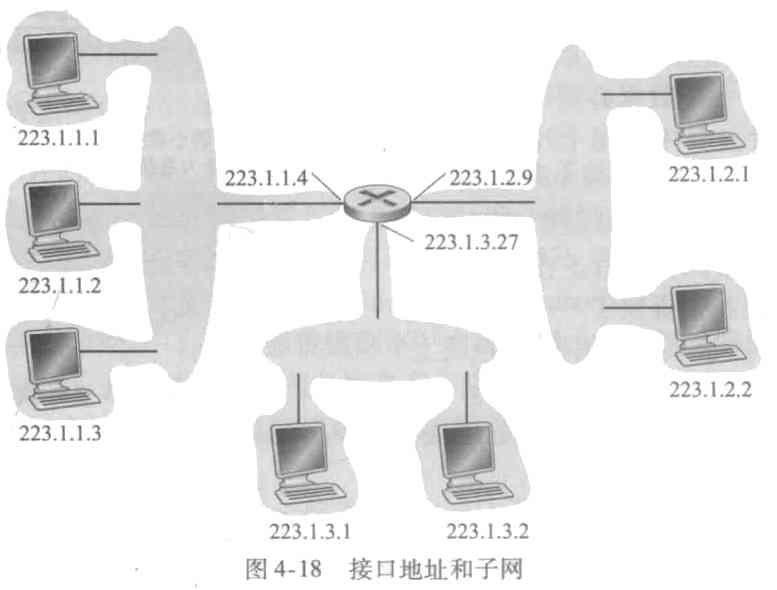

# 第4章 网络层：数据平面

本章我们将学习网络层是怎样实现主机到主机的通信服务的。

网络层分为**数据平面**和**控制平面**，它们之间的功能区别很重要，当你学习网络层时，心中记住这个区别，有助于你构思网络层，反映计算机网络中网络层角色的现代观点。

## 4.1 网络层概述

每台路由器的数据平面的主要作用是从其输入链路向其输出链路转发数据报；控制平面的主要作用是协调这些本地的每路由器转发动作，使得数据报沿着源和目的地主机之间的路由器路径最终进行端到端传送。

### 4.1.1 转发和路由选择：数据平面和控制平面

网络层的作用从表面上看极为简单，即，将分组从一台发送主机移动到一台接收主机。为此，需要使用两种重要的功能：

* **转发**。当一个分组到达某路由器的一条输入链路时，该路由器必须将该分组移动到适当的输出链路。转发是在数据平面实现的唯一功能，在最为常见的场合，分组也可能被现有的路由器阻挡，或者可能是冗余的并经过多条出链路发送。
* **路由选择**。当分组从发送方流向就收方是，网络层必须决定这些分组所采用的路由或路径。计算这些路径的算法被称为**路由决定算法**(urouting algorithm)。

每台网络路由器中有一个关键元素是它的转发表(forwarding table)。路由器检查到达分组首部的一个或多个字段值，进而使用这些首部值，指出了该分组将被转发的路由器的输出链路接口。如，根据下表，一个首部字段值为0111的分组到达路由器，该路由器在它的转发表中索引，并确定该分组的输出链路接口时接口2。

| 首部 | 输出 |
| ---- | ---- |
| 0100 | 3    |
| 0110 | 2    |
| 0111 | 2    |
| 1001 | 1    |

#### 1. 控制平面：传统的方法

那么转发表一开始是如何配置的呢？

路由选择算法可以运行在每台路由器中，并且每台路由器中都包含转发和路由选择两种功能。在一台路由器中的路由选择算法与在其他路由器中的路由选择算法通信，以计算出它的转发表的值。这种通信如何执行呢？通过根据路由选择协议交换包含路由选择信息的路由选择报文。我们之后再讨论这个协议。

可以用这样一个例子来理解上述方法。在设置路由器时，有专门的人员来设置这个转发表，通过和其他工作人员的交流，就可以确定这个转发表如何设置。在这个例子中，我们不需要任何协议。虽然实际上做不到，但理论上是可行的。

#### 2. 控制平面：SDN方法

我们可以让一个远程控制器来确定转发表，路由器只需要从这个远程控制器获得转发表，并执行转发就行了。就好像有专业人员为这台路由器设置好了转发表一样。

这个远程控制器可以是远程数据中心，ISP或某些第三方管理器。

路由器和远程控制器如何通信呢？通过交换包含转发表和其他路由选择信息的报文。这就是软件定义网络(Software-Defined Networking, SDN)的本质，因为计算转发表并与路由器交互的控制器是用软件实现的，故网络是“软件定义”的。

### 4.1.2 网络服务模型

网络服务模型(network service model)定义了分组在发送与接收端系统之间的端到端的运输特性。

我们现在考虑网络层能提供的某些可能的服务，包括：

* **确保交付**。确保分组将最终到达目的地。
* **具有时延上界的确保交付**。在一定的时间内确保交付。
* **有序分组交付**。确保分组以它们发送的顺序到达目的地。
* **确保最小带宽**。如果发送的速率小于某个值，则所有分组最终会交付到目标主机。
* **安全性**。网络层能对数据进行加密，并在目的地解密。

这只是网络层能够提供的服务的部分列表，有无数种可能的服务变种。

因特网的网络层提供了单一的服务，称为**尽力而为服务**(best-effort service)。使用尽力而为服务，传送的分组既不能保证以发送的顺序被接收，也不能保证它们最终交付；既不能保证端到端时延，也不能保证有最小的带宽。可以说时基本无服务了。

> 在接下来的内容开始前，先说明一下，因为业内经常互换的使用**转发**和**交换**这两个术语，我们之后也将这么做。 
> 另外当我们提到**分组交换机**时，我们说的是通用分组交换设备，可能是链路层交换机(link-layer switch)或路由器(router)。因为本章主要关注网络层，因此我们将使用路由器来代替交换机一词。

## 4.2 路由器工作原理

现在我们将注意力转向网络层的**转发功能**，即，实际将分组从一台路由器的入链路传送到适当的出链路。

下图展示了一个通用路由器体系结构的总体视图，这里标识了一台路由器的4个组件。

* **输入端口**。输入端口有这样几个重要功能。如上图所示的，输入端口最左侧的方框表示它在路由器中执行终结入物理链路的物理层功能。中间的方框表示它与位于入链路远端的数据链路层交互来执行数据链路层功能。更重要的是最右边的方框，输入端口还要执行查找功能，正是在这里通过查询转发表决定路由器的输出端口。
* **交换结构**。交换结构将路由器的输入端口连接到它的输出端口。这个交换结构完全包含在路由结构之中，即，它是一个网络路由器中的网络。
* **输出端口**。输出端口存储从交换结构接收的分组，并通过执行必要的链路层和物理层功能在输出链路上传输这些分组。当一条链路是双向的时，输出端口通常与该链路的输入端口成对出现在同一条线上。
* **路由选择处理器**。路由选择器执行控制平面功能。在传统路由器中，它执行路由选择协议，维护路由选择表与关联链路状态信息，并为该路由器计算转发表。在SDN路由器中，路由选择处理器负责与远程控制器通信，接收有远程控制器计算的转发表项。路由选择处理器还执行网络管理功能，我们将在之后学习。

将转发过程类比为汽车在立交桥上选择匝道，那么在汽车驶入立交桥前，需要做一点处理。

* **基于目的地的转发**。如果立交桥的某个出口就是汽车的目的地，那么入口的服务人员就会告诉车主该怎么走。
* **通用转发**。也有可能，服务人员会基于汽车的最终目的地、车牌号或者车辆状况，来确定指示出口。

### 4.2.1 输入端口处理和基于目的的转发

我们来考虑“最简单”的情况，一个入分组基于该分组的目的地址交换到输出端口。在32位比特IP地址的情况下，如果给每一个地址设置一个输出端口，那么就要设置超过40亿个地址，选择这种方法总体上是不可行的。

假设我们只有4个输出端口，编号为0~3。

| 前缀匹配                   | 链路接口 |
| -------------------------- | -------- |
| 11001000 00010111 00010    | 0        |
| 11001000 00010111 00011000 | 1        |
| 11001000 00010111 00011    | 2        |
| 其他                       | 3        |

当IP地址的前缀匹配时，将会被转发到相应的端口，如果存在与多个前缀相匹配，那么就使用最长前缀匹配，比如上表中，如果和链路接口1和2都匹配，那么会匹配更长的那一个，也就是1号链路。

确认了输出端口的分组就可以进入交换结构，如果交换结构正在被其他分组所使用，那么，分组就要等待。

在输入端口处，确认输出端口是最重要的动作，但还有其他必须完成的动作：

1. 必须出现物理层和链路层。
2. 必须检查分组的版本号、检验和以及寿命字段，并重写后两个字段。
3. 必须更新用于网络管理的计数器。

### 4.2.2 交换

交换可以由多种方式完成。

* **经内存交换**。最简单、最早的路由器是传统的计算机，在输入端口与输出端口之间的交换就是在CPU的直接控制下完成的。如果内存每秒能读写B个分组，那么总转发吞吐量必然小于B/2，且不能同时转发两个分组。
* **经总线交换**。在这种方法中，输入端口经一根共享总线将分组直接传送到输出端口，不需要路由选择处理器的干预。因为一次只有一个分组能跨越总线，路由器的交换带宽受总线速率限制。
* **经互联网络交换**。纵横式交换机就是一种由2N条总线组成的互联网络。纵横式交换机是非阻塞的，也就是说，只要目标端口没有被同时占用，交换机可以在同一时间交换多个分组。

### 4.2.3 输出端口处理

### 4.2.4 何处出现排队

显然在输入端口和输出端口都会出现排队，当队列过长，路由器没有缓存空间存放新到达的分组时，就会出现**丢包**。

#### 1. 输入排队

交换结构需要一定的时间将输入端口的分组交换到输出端口，因此如果输入端口分组到达的速率过快就会产生排队。

还有一种情况，在纵横式交换机中，假如有分组A和分组B都要发往1号输出端口，且A分组先行，这时B分组就要排队，于此同时，和B分组在同一条输入链路上且排在B之后的分组，即使其目的输出链路正空闲，也要等B分组被交换后再进行交换。这种阻塞被称为**线路前部**(Head-Of_line, HOL)**阻塞**。

#### 2. 输出排队

假设交换结构的速度足够快，且所有到达分组的目的地是同一个输出端口，这时就需要在输出端口排队。

当没有足够的内存来缓存一个新分组时，就要做出决定，是放弃到达的分组还是删除一个已排队的分组为新来的分组腾出空间。在某些情况下，在缓存填满之前就随便丢弃一个分组是有利的，还可以向发送方提供一个拥塞信号。

### 4.2.5 分组调度

假如在输出端口发生了排队，那么这些排队的分组将以什么次序出链路，就涉及分组调度了。

#### 1. 先进先出

先到达输出链路队列的分组先在链路上传输。

#### 2. 优先权排队

分组被分为高优先权和低优先权两种，优先传输高优先权的分组。

在非抢占式优先权排队规则下，一个分组开始传输后就不可被打断。相对的，在抢占式优先权排队规则下，即使一个分组已经开始传输了，这时如果一个具有更高优先值的分组到达，则会停止之前分组的传输，让具有更高优先值的分组传输。

#### 3. 循环加权公平排队

**循环排队**规则下，分组任然被分为两组，只不过没有优先权了，当第一组中的分组被传输了一个后，就去传输一个第二组的分组，如此循环。

**加权公平排队**，分组被分为好几类，因为每个类中的分组数量是不同的，按照每个类中的分组数量的多少来分配传输这个类中分组的时间。

## 4.3 网际协议：IPv4、寻址、IPv6及其他

### 4.3.1 IPv4数据报格式

IPv4数据报中的关键字段如下：

* **版本（号）**。长4个比特，规定了数据报的IP协议版本。
* **首部长度**。因为一个IPv4数据报可包含一些可变数量的选项，故需要用这4个比特来确定IP数据报中的载荷实际开始的地方。
* **服务类型**。服务类型(TOS)比特包含在IPv4首部中，以使不同类型的IP数据报能相互区别开来。比如某些数据报特别要求时延低或可靠性。
* **数据报长度**。这是IP数据报的总长度（首部加数据），以字节计。
* **标识、标志、片偏移**。这三个字段与所谓的IP分片有关，这是一个我们将很快要考虑的主题。IPv6已经不允许在路由器上对分组分片。
* **寿命**。寿命(Time-To-Live, TTL)字段用来保证数据报不会永远在网络中循环。每当一台路由器处理数据报时，该字段的值减一。若TTL减为0，则该数据报必须丢弃。
* **协议**。该字段通常仅当一个IP数据报到达其最终目的地时才会有用。例如，可以表示该字段应当交给TCP还是UDP。
* **首部检验和**。用于帮助路由器检测收到的IP数据报中的比特错误。
* **源和目的IP地址**。
* **选项**。选项字段允许IP字段首部被扩展。这些选项一般很少使用，IPv6中已经去掉了这一部分。
* **数据（有效载荷）**。这就是IP协议存在的理由，通常，这里面包含了运输层分组。

### 4.3.2数据报分片

我们将在第6章看到，并非所有链路层协议都能承载相同长度的网络层分组。有的协议能承载大数据报，而有的协议只能承载小分组。

加入一个路由器从某条链路上收到的分组大于输出链路能承载的大小，就需要将分组分片成多个较小的IP数据报，用单独的链路层帧封装这些较小的IP数据报。每个这些较小的数据报都被成为片(fragment)。

片在到达目的地运输层以前需要重新组装。运输层当然希望收到完整的分组，而将重新组装这一工作交给路由器将给协议带来相当的复杂性且影响路由器性能。为坚持网络内核保持简单的原则，IPv4的设计者决定将数据报的重新组装工作放到端系统中，而非网络路由器中。

为了让目的主机执行这些重新组装任务，IPv4的设计者将标识、标志和片偏移字段放在IP数据报首部中。

其中，标识就是原本数据报分组的标识，用以标识这个片属于哪一个大的分组；片偏移指出这个片在原分组的顺序；标志比特可以是1或0，为0时表示这是最末尾的片。

### 4.3.3 IPv4编址

在讨论IP编址之前，我们先简述一下主机与路由器连入网络的方法。一台主机通常只有一条链路连接到网络；当主机想发送一个数据报时，它就在该链路上发送。

主机与物理链路之间的边界叫做**接口**(interface)。现在考虑一台路由器及其接口。因为路由器的任务是从链路上接收数据报并从某些其他链路转发出去，路由器必须拥有两条或更多条链路与它连接。路由器与它任意一条链路之间的边界也叫接口。一台路由器因此有多个接口，每个接口有其链路。因为每台主机与路由器都能发送和接收IP数据报，IP要求每台主机和路由器拥有自己的IP地址。因此，从技术上讲，一个IP地址与一个接口相关联，而不是与包括该接口的主机或路由器相关联。

每个IP地址的长度为32比特，因此共有$2^{32}$个（约40亿个）可能的IP。这些地址通常按**点分十进制记法**(dotted-decimal notation)书写，即地址中的每个字节用它的十进制形式书写，各字节间用句点隔开。

全球因特网中的每台主机和路由器上的每个接口，都必须有一个全球唯一的IP地址（在NAT后面的接口除外）。然而这些地址不能随意地自由选择。一个接口的IP地址的一部分需要由其连接的子网来决定。

下图是一个IP编址与接口的例子。

看到左侧的三台主机都以和路由器向左的接口IP都以223.1.1开头，也就是说在它们的IP地址中最左侧的24比特是相同的。这4个接口也通过以太网LAN或者无线网相连接。

用IP属于来讲，互联这3个主机接口与1个路由器接口的网络形成一个**子网**(subnet)。IP编址为这个子网分配一个地址223.1.1.0/24，其中的/24记法，有时称为**子网掩码**(nwework mask)，指示32比特中的最左侧24比特定义了子网地址。任何想要连接到这个子网的接口都要求其地址具有223.1.1.*的形式。

一个子网的定义并不局限于连接多台主机到一个路由器接口的以太网段。看到下图：

如果我们按照之前的方法找子网的话，会找到6个子网，R1, R2, R3 分别与两台主机连接成了一个子网。这三台路由器之间也两两组成了子网。

因此，显然一个具有多个以太网段和点对点链路的组织将具有多个子网，在给定子网上的所有设备都具有相同的子网地址。原则上，不同的子网能够具有完全不同的子网地址。然而，在实践中，它们的子网地址经常有许多共同之处。为了理解其中的道理，我们来关注在全球因特网中时如何处理编址的。

因特网的地址分配策略被称为**无类别域间路由选择**(Classless Interdomain Routing, CIDR)。CIDR将子网寻址的概念一般化了。当使用子网寻址时，32比特的IP地址被划分为两部分，并且也具有点分十进制数形式a.b.c.d/x，其中x指示了地址的第一部分中的比特数。

形式为a.b.c.d/x的地址x最高比特构成了IP地址的网络部分，并且经常被称为该地址的**前缀**(prefix)。一个组织通常被分配一块连续的地址，即具有相同前缀的一段地址。

除去前缀外的32-x位比特可认为时用于区分该组织内部设备的，其中的所有设备具有相同的网络前缀。当该组织内部的路由器转发分组时，才会考虑这些比特。

还有一类IP地址应当被提及，即IP广播地址255.255.255.255。当一台主机发出一个目的地址为255.255.255.255的数据报时，该报文会交付给同一网络中的所有主机。路由器也会有选择地向邻近的子网转发该报文。

现在我们已经详细地学习了IP编址，需要知道主机或子网最初是如何得到它们的地址的。我们先看一个组织是如何为其设备得到一个地址块的，然后再看一个设备是如何从某组织的地址块中分配到一个地址的。

#### 1.获取一块地址

为了获取一块IP地址用于组织的子网内，网络管理员可以与ISP联系，该ISP可能会从已分给他的更大地址块中提供一段地址。

还有一种方法，从上述方法中我们可以得知，显然有一种方法向ISP提供一块地址。是否有一个全球性的权威机构，它具有管理IP地址空间并向各ISP和其他组织分配地址块的最终责任呢？的确有一个，IP地址由**因特网名字和编号分配机构**(Internet Corporation for Assigned Names and Numbers, ICANN)管理。这是一个非营利组织，它的作用不仅是分配IP地址，还管理DNS根服务器。它还有一项容易引起争论的工作，即解决域名纷争。

#### 2.获取主机地址：动态主机配置协议

主机的地址可以手动配置，但这项任务目前更多的是使用**动态主机配置协议**(Dynamic Host Configuration, DHCP)来完成。DHCP允许主机自动获取一个IP地址。网络管理员能够配置DHCP，以使某给定主机每次与网络连接时能得到一个相同的IP地址，或给某主机分配一个临时的IP地址。除了主机IP地址分配外，DHCP还允许主机得知其他信息，例如子网掩码、它的第一跳路由器地址（默认网关）与它的本地DNS服务器的地址。

DHCP是一个客户-服务器协议。客户通常时新到达的主机，它要获得包括自身使用的IP地址在内的网络配置信息。

DHCP有4个步骤：

* **DHCP服务器发现**。一台新到达的主机的首要任务是发现一个要与其交互的DHCP服务器。这可通过**DHCP发现报文**(DHCP discover message)来完成，客户在UDP分组中向端口67发送该发现报文。但是这个数据报发送给谁呢？这种情况下，DHCP客户生成包含DHCP发现报文的IP数据报，其中使用广播目的地址255.255.255.255并且使用“本主机”源IP地址0.0.0.0。
* **DHCP服务器提供**。DHCP服务器收到一个DHCP发现报文时，用**DHCP提供报**(DHCP offer message)文向客户做出响应，该报文向该子网的所有节点广播，仍然使用IP广播地址255.255.255.255。因为一个子网中可能有几个DHCP服务器，因此客户可以在收到的提供报文之间进行选择。
* **DHCP请求**。客户从一个或多个服务器提供中选择一个，并向选中的服务器体统用**DHCP请求报文**(DHCP request message)进行响应，回显配置参数。
* **DHCP ACK**。服务器用DHCP ACK报文对DHCP请求报文做响应，证实要求的参数。

DHCP十分方便，可以自动配置IP地址等信息，但DHCP还有一个非常严重的缺陷。一个节点每次连入子网时都要通过DHCP进行配置，当这个节点在子网之间移动时，就不能维持与远程应用之间的TCP连接。我们之后会研究移动IP，允许移动节点在网络之间移动时使用其单一永久的地址。

### 4.3.4 网络地址转换

网络地址转换(Network Address Translation, NAT)。使用了NAT的路由器对于外部世界来说甚至不像一台路由器，相反NAT路由器对外界的行为就如同一个具有单一IP地址的单一设备。

我们的设备仅仅连接到NAT路由器上，使用由这个路由器分配的IP地址，而真正向互联网发送信息、从互联网接收信息的是NAT路由器。因此，这时设备所使用的IP地址，在别的子网下并无意义。

既然所有信息都由路由器收发，那么怎么区分不同主机之间的信息呢？NAT路由器中有一张NAT转换表，在表项中包含了端口号及其IP地址。通过路由器上的端口号，就可以分辨这个信息由哪一台主机发出，应当发送至哪一台主机。

### 4.3.5 IPv6

#### 1.IPv6数据报格式

IPv6中引入的最重要的变化显示在其数据报格式中：

* **扩大的地址容量**。IPv6将IP地址长度从32比特增加到128比特。这就确保全世界将不会用尽IP地址。IPv6还引入了一种称为**任播地址**(anycast address)的新型地址，这种地址可以使数据报交付给一组主机中的任意一个。
* **简化高效的40字节首部**。许多IPv4字段已被舍弃或作为选项。因而所形成的40字节定长首部允许路由器更快地处理IP数据报。
* **流标签**。“流”的定义还不是很明确。参见RFC 2460。

IPv6数据报的结构更简单、更高效。以下是在IPv6中定义的字段。

* **版本**。该4比特字段用于标识IP版本号。IPv6将该字段设置为6。注意到将该字段设置为4并不能创建一个合法的IPv4数据报。
* **流量类型**。该8比特字段与我们在IPv4中看到的TOS字段的含义相似。
* **流标签**。该20比特的字段用于标识一条数据报的流，能够对一条六种的某些数据给出优先权。
* **有效载荷长度**。该16比特值作为一个无符号整数，给出了IPv6数据报中跟在定长的40字节数据报首部后面的字节数量。
* **下一个首部**。该字段标识数据报中的内容（数据字段）需要交付给哪个协议（如TCP或UDP）。该字段使用与IPv4首部协议字段相同的值。
* **跳限制**。转发数据报的每台路由器将对该字段的内容减1.如果跳限制计数达到0，则该数据报将被丢弃。
* **源地址和目的地址**。IPv6 128比特地址的各种格式在RFC 4291中进行了描述。
* **数据**。这是IPv6数据报的有效载荷部分。

我们会注意到，在IPv4数据报中出现的几个字段在IPv6数据报中已不复存在：

* **分片**。IPv6不允许在中间路由器上进行分片与重新组装。这种操作只能在源与目的地执行，如果路由器收到的分组太大，因而不能转发到出链路上，就丢弃该分组并返回一个“分组太大”。的ICMP差错报文即可。
* **首部检验和**。因为运输层和数据链路层协议执行了检验操作。
* **选项**。选项字段不再是标准IP首部的一部分了。但它并没有消失，而是可能出现在IPv6首部中由“下一个首部”指出的位置上。

#### 2.从IPv4到IPv6的迁移

那么基于IPv4的公共因特网如何迁移到IPv6呢？虽然新型的使用的IPv6系统可以做成向后兼容，也可以发送、路由和就收IPv4数据报，但已部署的使用Ipv4的系统却不能够处理IPv6数据报。

一种方法是宣布一个标志日，即指定某个日期和时间，到时候因特网的所有机器都关停，并升级到IPv6。但这种方法显然不可行。

有这样一种方法，**建隧道**(tunneling)。假设有两个IPv6路由器之间要传输报文，而它们是经由IPv4路由器互联的。那么我们将这两个IPv6路由器之间的IPv4路由器集合称为隧道。发送报文的IPv6路由器将整个IPv6报文装入一个IPv4报文中，一直到接收报文的IPv6路由器接收到后，再打开。

## 4.4 通用转发和SDN

在现代网络中，许多执行第三层功能的中间盒有了大量发展。NAT盒重写首部IP地址和端口号；防火墙基于首部字段值阻拦流量或重定向分组以进行其他处理，如深度分组检测(DPI)。

第二层交换机和第三层路由器等中间盒的剧增，而且每种都有自己特殊的硬件、软件和管理界面，给网络管理提出了麻烦。然而，近期软件定义网络的进展已经预示并且正在提出一种统一的方法，以一种现代、简洁和综合的方式，提供多种网络层功能以及某些链路层功能。

回顾4.2.1节中基于目的地转发的特种总结为两个步骤：查找目标IP地址，然后将分组发送到有特定输出端口的交换结构。

我们现在考虑一种更有意义的通用“匹配加动作”范式，其中能对协议栈的多个首部字段进行“匹配”，这些首部字段是与不同层次的不同协议相关联的。“动作”能够包括：将分组转发到一个或多个输出端口（就像在基于目的地转发中一样），跨越多个通向服务的离开接口进行负载均衡分组（就像在负载均衡中一样），重写首部值（就像在NAT中一样），有意识地阻挡、丢弃某个分组（就像在DPI中一样），等等。

每台分组交换机中都有一张匹配加动作表，该表由远程控制器计算、安装和更新。

我们后续对通用转发表的讨论将基于OpenFlow，OpenFlow是一个得到高度认可和成功的标准，它已经成为匹配加动作转发抽象、控制器以及更为一般的SDN革命等概念的先驱。我们将主要考虑OpenFlow 1.0，该标准以特别清晰简明的方式引入了关键的SDN抽象和功能。

匹配加动作转发表在OpenFlow中称为**流表**(flow table)，它的每个表项包括：

* **首部字段值的集合**，入分组将与之匹配。
* **计数器集合**（当分组与流表项匹配时更新计数器）。这些计数器可以包括已经与该表项匹配的分组数量，以及自从该表项上次更新以来的时间。
* **所采取的动作集合**，当分组匹配流表项时可能采取的动作，如将分组转发到给定的输出端口，丢弃该分组、复制该分组和将它们发送到多个输出端口，和重写所选的首部字段。

### 4.4.1 匹配

上图显示了11个分组首部字段和入口端ID，该ID能被OpenFlow 1.0中的匹配加动作规则所匹配。

图中源和目的MAC地址是与帧的发送和接收接口相关的链路层地址；通过基于以太网地址而不是IP地址进行转发，我们看到OpenFlow使能的设备能够等价于路由器（第三层设备）转发数据报以及交换机（第二层设备）转发帧。

入端口是指分组交换机上接收分组的输入端口。在4.3.1中我们已经讨论过分组的IP源地址、IP目的地址、IP协议字段和IP服务类型字段。运输层源和目的端口号字段也能匹配。

流表项也可以由通配符。例如，在一个流表中IP地址128.119.\*.\*将匹配其地址的前16比特为128.119的任何数据报所对应的地址字段。每个流表项也有相应的优先权。如果一个分组匹配多个流表项，选定的匹配和对应动作将是其中有最高优先权的那个。

### 4.4.2 动作

每个流表项都有零个或多个动作列表，这些动作决定了应用于与流表项匹配的分组处理。如果有多个动作，它们可以按表中规定的次序执行。

其中最重要的动作可能是：

* **转发**。一个入分组可以转发到一个特定的物理输出端口，广播到所有端口，或通过所选的宽口集合进行多播。
* **丢弃**。没有动作的流表项表明某个匹配的分组应当被丢弃。
* **修改字段**。在分组被转发到所选的输出端口之前，分组首部10个字段（上图中出IP协议字段外的字段）中的值可以重写。

### 4.4.3 匹配加动作操作中的OpenFlow例子

依照下图，我们来给出使用OpenFlow的例子。

#### 第一个例子：简单转发

作为一个非常简单的例子，假定希望的转发行为是：来自h5或h6发往h3或h4的分组从s3转发到s1，然后从s1转发到s2（避免使用s3和s2之间的链路）。

在s1中流表项是：

| 匹配 | 动作 |
| ---- | ---- |
| Ingress Port=1; IP Src=10.3.\*.\*; IP Dst=10.2.\*.\* | Forward(4) |

s3的流表项，用来将分组转发到s1：

| 匹配 | 动作 |
| ---- | ---- |
| IP Src=10.3.\*.\*; IP Dst=10.2.\*.\* | Forward(3) |

最后在s2处将分组转发到h3或h4：

| 匹配 | 动作 |
| ---- | ---- |
| Ingress Port=2; IP Dst=10.2.0.3 | Forward(3) |
| Ingress Port=2; IP Dst=10.2.0.4 | Forward(4) |

#### 第二个例子：负载均衡

我们考虑这样一个场景，其中来自h3发往10.1.\*.\*的数据报经过s1和s2之间的直接链路转发，与此同时来自h4发往10.1.\*.\*的数据报经过s2和s3之间的链路转发。

这时s2中流表项将是：

| 匹配 | 动作 |
| ---- | ---- |
| Ingress Port=3;IP Dst=10.1.\*.\* | Forward(2) |
| Ingress Port=4;IP Dst=10.1.\*.\* | Forward(1) |

#### 第三个例子：充当防火墙

我们考虑一个防火墙的场景，其中s2仅希望接收来自与s3相连的主机所发送的流量。

s2的流表如下：

| 匹配 | 动作 |
| ---- | ---- |
| IP Src=10.3.\*.\*; IP Dst=10.2.0.3 | Forward(3) |
| IP Src=10.3.\*.\*; IP Dst=10.2.0.4 | Forward(4) |

## 4.5 小结

本章我们主要讨论了网络层的**数据平面**(data plane)功能，即每台路由器的如下功能：决定到达路由器的输入链路之一的分组如何转发到该路由器输出链路之一。
