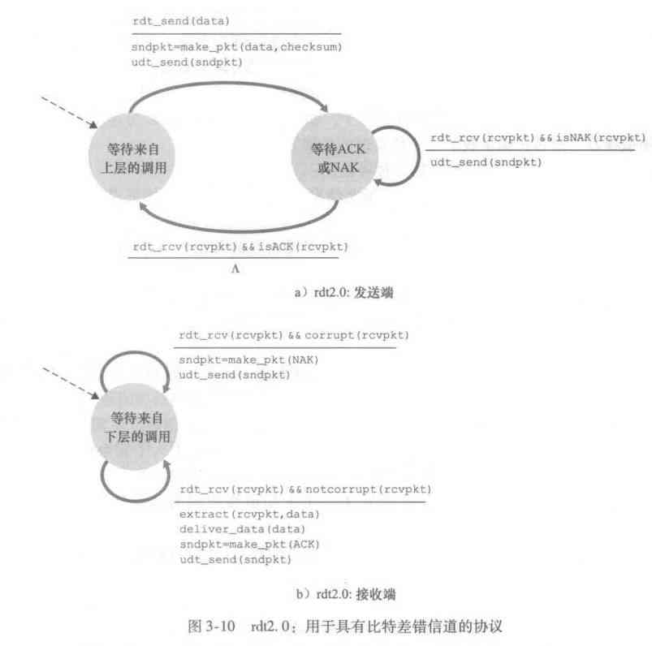
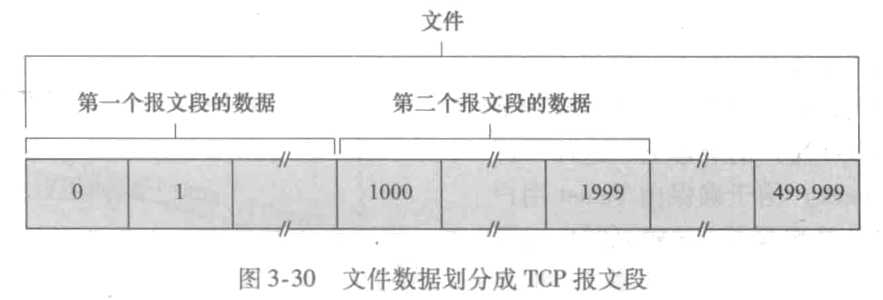
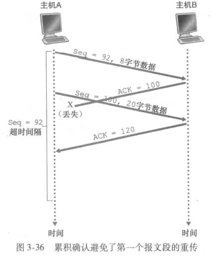

# 第3章 运输层

本章，我们与往常一样，将特别关注因特网协议，即TCP和UDP运输层协议。

我们将讨论运输层和网络层的关系。然后讨论计算机网络中最为基础性的问题：如何可靠地通信和如何控制拥塞。

## 3.1 概述和运输层服务

运输层协议为运行在不同主机上的的应用程序之间提供了**逻辑通信**（logic communication）功能。

通过逻辑通信，运行不同进程的主机好像直接相连一样，实际上，这些主机也许位于地球两侧。

运输层协议是在端系统中而不是在路由器中实现的。

在发送端，运输层将从发送应用程序进程接收到的报文转换成运输层分组，术语称之为运输层**报文段**（segment）。实现的方法（可能是）将应用报文分割成小块，每块加上运输层首部。

然后，运输层将这些报文段传递给网络层，网络层将其封装成网络层分组（即数据报）并向目的地发送。

### 3.1.1 运输层和网络层的关系

网络层提供了**主机**之间的逻辑通信，而运输层为不同主机上的进程之间提供了逻辑通信。

一台主机内，所有进程发送报文，都会经过运输层整理，统一交由网络层。同理，所有进程的报文接收，由网络层直接交给运输层，运输层分拣交给各个进程。

例子：

> 上海老张家有4个人，北京老李家有4个人，这两家常年互相写信。</br>
> 老张家的人信写好后，都交给张三，张三负责交给邮局。</br>
> 老李家的人信写好后，都交给李四，李四负责交给邮局。</br>
> 同理，张三家里的来信也由张三负责收集，分给家里人。</br>
> 同理，李四家里的来行也由李四负责收集，分给家里人。</br>

这里有：

```xml
应用层报文 = 信封上的字符
进程 = 家里的人
主机（端系统） = 家庭
运输层协议 = 张三 和 李四
网络层协议 = 邮政服务
```

继续看这个例子。

张三和李四都是在自己家里工作的，而且邮局并不关心这个家里信是谁负责收发的。家里收发信件的也可以是别的成员，正如运输层有好几种协议。

很明显，信件的传输速度并不能由张三和李四控制，运输层协议受制于网络层协议的服务模型。然而，即使网络层协议不能再网络层提供相应服务，运输层协议也能提供某些服务。例如，即使底层网络协议是不可靠的，运输协议也能为应用程序提供可靠的数据传输服务。

### 3.1.2 因特网运输层概述

因特网为应用层提供了TCP和UDP两种服务，UDP不可靠、无连接，TCP是可靠的，面向连接的。编写应用程序时，程序员必须指定一种运输层协议。

特别指明，书中将运输层报文称为报文段（segment），事实上，只有TCP的运输层分组为报文段，而UDP的运输层分组为数据报（datagram）。但同时，网络层分组也被称为数据报，因此，为了避免混淆，这里将运输层报文统称为报文段。

在介绍TCP和UDP之前先简单介绍一下网络层。因特网网络层有一个协议称为IP，即网际协议。IP为主机之间提供了逻辑通信。IP的服务模型是**尽力而为交付服务**（best-effort deliveryservice），这就是说，IP不会确保报文段的交付，也不保证报文端的有序和完整。因此，IP被称为**不可靠服务**（unreliable service）。

TCP和UDP的基本责任是，将两个端系统间IP的交付服务扩展为运行在端系统上的两个进程之间的交付服务，这被称为**运输层的多路复**（transport-layer multiplexing）用与**多路分解**（demultiplexing）。

另，TCP提供了一些附加服务，它提供**可靠数据传输**和**拥塞控制**。

## 3.2多路复用与多路分解

应用程序发送、接收数据需要套接字。

将运输层报文段中的数据交付到正确的套接字的工作称为**多路分解**。

在源主机从不同套接字中收集数据块，并为每个数据块封装上首部信息从而生成报文段，然后将报文段传递到网络层，这些工作称为**多路复用**。

为了实现上述两个功能：

1. 套接字有唯一的标识符
2. 每个报文有特殊字段来指示该报文所要交付的套接字。

这两个特殊字段就是**源端口号字段**和**目的端口号字段**。

端口号是一个16比特的数，其大小在0~65535之间。0~1023号端口称为**周知端口号**，是留给HTTP，FTP等基础功能使用的。

### 1. 无连接的多路复用与多路分解

在UDP中如下代码用于绑定端口号：

`clientSocket.bind(('', 19157))`

主机通过检查报文中的端口号，就可以将每个报文段定向到响应的套接字。

注意，一个UDP套接字是由一个二元组全面标识的，该二元组包含一个目的IP地址和一个目的端口号。也就是，源IP地址和源端口号，虽然附在了报文中，却不用于标识。

两个不同的报文来源，如果目的指向了同一主机的同一端口，就会被同一套接字所接收。

### 2. 面向连接的多路复用与多路分解

TCP套接字与UDP套接字不同的是，TCP套接字由一个四元组（源IP地址，源端口号，目的IP地址，目的端口号）来标识。

两个不同的报文来源，即使指向了同一主机的同一端口也会被两个不同的套接字接收。

### 3. Web服务器与TCP

Web服务器如Apache通常使用周知端口号80，可以通过来源来分辨是不同的请求。

## 3.3 无连接运输：UDP

由[RFC 768]定义的UDP只做了运输协议能够做的最少工作。除了复用/分解功能及少量的差错检测外，它几乎没有对IP增加别的东西。

如果程序员选择使用UDP而非TCP，则正在开发的应用程序差不多就是直接与IP打交道。

在发送报文段之前，发送方和接收方的运输层实体之间没有握手，因此，UDP被称为是**无连接**的。

虽然UDP有着种种不便，但UDP也有其优点：

* **关于发送什么数据以及何时发送的应用控制更为精细**。因为TCP有着拥塞控制和可靠传输，当一条线路十分拥堵时，TCP会降低传输速率，并仍确认传输完成。而这对有延时要求的，且可以忍受一定数据丢失的程序不适合。
* **无须连接建立**。不必三次握手，使得UDP连接时延更小。这也是DNS采用UDP的原因。
* **无连接状态**。TCP需要在端系统中维护连接状态，包括接收和发送缓存、拥塞控制参数以及序列号与确认号参数。UDP的开销因此更小。
* **分组首部开销少**。TCP首部有20字节，而UDP仅有8字节。

### 3.3.1 UDP报文段结构


UDP首部有4个字段，源端口号和目的端口号不做解释。

长度字段指示了在UDP报文段中的字节数（首部加数据），因为每个UDP报文的应用数据字段长度不同。

检验和可以验证该报文段中是否出现了差错。实际上计算检验和时，除了UDP报文段以外还包括了IP首部的一些字段，但这里我们忽略这些细节。

### 3.3.2 UDP检验和

UDP检验和提供了差错检测功能。在RFC 1071中可以找到有效实现的细节。

举例来说，有如下3组16比特的字：

```num
0110011001100000
0101010101010101
1000111100001100
```

这三组比特的和为：`0100101011000010`

但这里注意，最高位其实溢出了，因此，这个和要回卷，就是将所有的0换为1，1换为0.

因此最终结果为`1011010100111101`，

接收方将检验和，与之前三个比特字加在一起，结果应为`1111111111111111`.如果结果中有一位是0，那么可知，分组中出现了差错。

## 3.4 可靠数据传输原理


如上图，借助可靠数据传输协议（reliable data transfer protocol），即使底层信道是不可靠的，我们也能向高层提供可靠传输。

在本节中，我们仅考虑**单向数据传输**（unidrectional data transfer）。可靠的**双向数据传输**（bidirectional data transfer）（全双工数据传输）从概念上并不难，但解释起来更加乏味。

### 3.4.1 可靠数据传输协议

#### 1. 经完全可靠信道的可靠数据传输：rdt1.0


上图显示了rdt1.0发送方和接收方的**有限状态机**（Finite-State Machine, FSM）。

先简单介绍一下这种图：

* **深色的圆**指的是**状态**，可以看到这里发送方和接收方都只有一种状态。
* **虚线箭头**指的是**初始状态**，这里只有一种状态，但之后会有更加复杂的图。
* **实现箭头**描述了**状态的转化**，因为这里只有一种状态，因此转化后又回到初始状态。
* **横线上方**的是引起状态变化的**原因**。
* **横线下方**是状态变化时的**动作**。

如果**没有**原因或动作就完成了状态转化，就在相应位置填上来$\Lambda$注明。

rdt的发送端只通过rdt_send(data)时间接收来自高层的数据，产生一个包含该数据的分组（经由make_pkt(data)动作），并将分组发送到信道中。实际上，rdt_send(data)事件时由较高层应用的过程调用产生的。

在这个简单协议中，因为有了完全可靠的信道，因此不必担心出错。这里我么假定发送方发送数据的速率和接收方接收数据的速率一样块，因此，接收方没有必要请发送方慢一点。

#### 2. 经具有比特差错信道的可靠数据传输：rdt2.0

目前，我们仍假设所有发送的分组按其发送的顺序被接收。

考虑现实生活中，我们打电话时是怎样保证可靠传输的？当我们听（接收）时，如果听清了对方（发送方）的话，我们就回一个“OK”，如果没有听清，就说“请重复一遍”。

这种口述报文协议使用了**肯定确认**（OK）和**否定确认**（请重复一遍），使得发送方知道哪些内容被正确接收，哪些内容需要重复。在计算机网络中，这样的协议称为**自动重传请求协议**（Automatic Repeat reQuest, ARQ）。

ARQ协议需要另外三种协议功能来处理存在比特差异的情况：

* **差错检测**。之前我们讲过的UDP检验和就是为了这个目的。之后（第5章）我们将更详细的学习这一技术。
* **接收方反馈**。发送方需要知道接收方是否正确接收了数据。理论上只需要一个比特，如0为NAK（否定确认），1为ACK（肯定确认）。
* **重传**。接收方收到的分组有差错时，发送方将重传该分组。

具体如下图：



当发送方等待接收方的NAK或ACK分组时，是不会发送数据的，因此rdt2.0这一协议也被称为**停等**（stop-and-wait）协议。

rtd2.0看起来可以运行了，但事实上，它存在一个致命缺陷。我们没有考虑到ACK或NAK分组受损的可能性。

处理受损的NAK和ACK分组有三种可能：

* 第一种方法，引入一种新的分组，当NAK和ACK受损时，发送方再一次询问接收方是否正确接收，但这一新的分组也有可能受损，然后接收方询问“请重复一遍”，这样，要回答的内容就显得含糊不清了。
* 第二种方法，增加足够的校验和比特，这样，发送方就不仅可以检验差错，还可以恢复差错。对于会产生比特差错，但不会丢失分组的信道，这样就可以解决问题。
* 第三种方法是，当发送方不知道接收方发送的是NAK还是ACK时，只需重传当前数据分组即可。这样会造成**冗余分组**，但接收方却不知道这是否是自己已经接收过的数据分组。

对于第三种方法，只需让发送方在发送时对数据分组编号，即，将发送数据分组的**序号**添加到新的字段里即可。这样接收方只需检查数据分组的序号就知道这是否时冗余了。

在停等协议中，序号字段只需要1比特，用0和1将相邻的分组区分开来就好了。那么，对于发送方，就要分成发送0分组，发送1分组两种情况，对于接收方也要分成接收0分组，接收1分组两种情况。

当然，对于接收方，如果0号分组有损坏，返回一个0号NAK和返回一个1号ACK的意义是相同的，都可用来指示0号分组的损坏。这样，我们其实就可以抛弃NAK了。

#### 3. 经具有比特差错的丢包信道的可靠数据传输：rdt3.0

现在假定，除了比特受损之外还会丢包。协议就必须处理两个另外的问题：怎样检测丢包以及发生丢包后该做什么。

有很多种方法用于解决丢包问题。这里我们让发送方负责检测和回复丢包工作。假定发送方传输一个数据分组，该分组或者接收方对该分组的ACK发生了丢失，这两种情况下，发送方都会收不到应当来的接收方的响应。如果发送方愿意等待足够长的时间以**确定**分组丢失，则它只需重传即可。

那么发送方需要多久来确定已经丢包了呢？很明显，至少等待发送方到接收方一个来回的时延，考虑到接收方要对分组做处理等等其他操作和意外，实际时间可能更长。

但等待那么长时间是不可取的，因此实践中，我们采取一个特定的值，以判断是否丢包。不过同样的，这样会引入**冗余数据分组**，不过，在上一节中，通过对数据分组添加序号就能解决这个问题。

### 3.4.2 流水线可靠数据传输协议

rdt3.0是一个功能正确的协议，但因为它是一个停等协议，因此性能十分受限。

比如，我们假设北京上海这两地各有一台主机，它们之间的往返传播时延RTT大约为30毫秒。假定它们之间的通路发送速率为R = 1 Gb/s($10^9$ bit/s)。同时假设一个分组的长度为L = 1000 bit。那么，发送一个分组进入链路的需要的时间为：

$$
t_{trans} = \frac{L}{R} = \frac{8000bit/pkt}{10^9bit/s} = 8\mu s/pkt
$$

也就是0.008ms。

发送端从t=0时开始发送分组，0.008ms后分组的最后一个比特进入信道，经过15ms后发送到接收端，15.008ms后接收端接收到最后一个比特然后返回一个ACK分组，这里假设ACK分组进入信道的时间为0，那么又15ms后，即30.008ms后发送端收到ACK分组开始发送下一个分组。我们简单计算一下发送方对于信道的利用率：

$$
U_{sender} = \frac{L/R}{RTT + L/R} = \frac{0.008}{30.008} = 0.00027
$$

这就是说发送方只有万分之2.7的时间是忙的。

解决这种特殊的性能问题的一个简单方法是：不以停等方式运行，允许发送方发送多个分组而无需等待确认。


像这样发送方可以等待确认之前发送的3个报文，那么其利用率也提高了3倍。这种技术就是**流水线**（pipelining）。流水线技术对可靠传输协议带来以下影响：

* 必须增加序号范围，因为每个传输中的分组（不计算重传的）必须有一个唯一的序号。
* 协议的发送方和接收方两端也许不得不缓存许多个分组。发送方最低限度应当能缓冲那些已发送但没有确认的分组。如下面讨论的，接收方或许也需要缓存那些已正确接收的分组。
* 所需序号范围和缓冲的要求取决于数据传输协议如何处理丢失、损坏及延时过大的分组。解决流水线的差错回复有两种基本方法是：**回退N步**（Go-Back-N, GBN）和**选择重传**（Selective Repeat, SR）。

### 3.4.3 回退N步


这里书上讲的比较复杂，我会适当简化一些，当然细节之处没有那么严谨了。

传输时首先确定一个长度N，可能是$2^k$，k就是序号字段的长度。（在rtd3.0中这个k就是1，N的长度就是2，序号仅分为[0, 1]两种）

传输时，对于发送方有一个**基序号**（SendBase），就是最早的已发送的，但还未被确认的那个分组的序号，还有一个**下一个序号**(NextSeqNum)就是最早的，在窗口N里边，但还未被发送的分组的序号。具体的划分看图就行了。

这里提一下，基序号是一个变化的量，当窗口在不同位置时，基序号也不同，分组的序号是不变的，在给分组编号时，如果序号不够用了，那就从0重新开始，这样能保证窗口内的分组每个编号都不一样，同时当窗口移动后，也不会混淆之前的分组编号。

随着协议的运行，窗口也向前滑动，因此N也称为**窗口长度**，GBN协议也称为**滑动窗口协议**（sliding-window protocol）。

GBN发送方必须响应3种事件：

* **上层的调用**。当上层调用rdt_send()时，发送方检查窗口内是否还有为发送的分组，若有，则发送一个最近的分组，若无，则返回一个窗口已满。或者，使用同步机制，让上层仅在窗口不满时才调用tdt_send()。
* **收到一个ACK**。当发送方收到第n个分组的ACK时就知道序号为n和n之前的分组已经正确接收了。这就是**累积确认**（cumulative acknowledgment）的方式。
* **超时事件**。如果某个分组的响应超时了，那就从这个分组开始，把所有已发送但未确认的分组重新传输一遍。这种处理方式也是协议“回退N步”名字的来源。

对于接收方，只按顺序接收分组，如果中间有某个分组出错了，那么就算之后的分组正常到达，也要全部丢弃，等待发送方回退N后重新传输之前那个出错的分组。

这里给出示意图：


### 3.4.4 选择重传

在回退N步中，假设窗口很大挥着带宽延时积很大时，GBN的性能就有问题了。比如，窗口大为1000，那么最坏情况下，就有1000个分组要重传。

在选择重传中，我们不会丢弃那些正确传输的分组，而是先缓存起来，只重新发送那些传输错误的分组。

SR中发送方的事件：

* **从上层收到数据**。这里同GBN差不多。
* **超时**。在SR中，每个分组都有自己的计时器，因为当超时时，我们只重新传输那个超时的分组。
* **接收到ACK**。收到ACK后，我们将相应序号的分组标记为正确接收，如果ACK的序号为基序号，那么窗口向前移动一个分组。

SR中接收方的事件：

这里提一下，接收方也有自己的窗口，用来记录，已经缓存的失序分组，窗口内等待接收的分组和还未接收的分组。

* 正确接收到窗口内的分组时，返回一个ACK，如果该分组之前没有收到过，那么就缓存这个分组，并标记一下，如果这个分组的序号等于基序号，那么就将这个分组交付给高层，然后将窗口向前移动。并且，如果这个分组之后的分组在之前就已经缓存过了那么就将已经缓存的分组交付给上层，将窗口向前移动，一直到某个没有缓存的分组为止。
* 接收到之前就已经交付的分组，返回一个ACK
* 其他的分组，忽略。

这里给出示意图：


但，在这种操作下，还有一个问题，假设N为4，分组序号为[0, 1, 2, 3]，那么当前4个成功传输之后，发送方又发来0号分组，接收方是无法确定这是一个新的0号分组（其实是4号，但因为编号不够用，而对4取模的新0号）还是因为之前的0号ACK没有正确传输而重新传的0号（就是原本的0号）分组呢？

为了解决这个问题，我们要保证窗口大小小于或等于序号的一半。具体的原因书上要求读者自己证明，大家也自己想一下吧，应该还是比较简单的。

## 3.5 面向连接的运输：TCP

TCP定义在RFC 793、RFC 1122、RFC 1323、RFC 2018以及RFC 2581中。

### 3.5.1 TCP连接

在使用TCP传输数据之前先要进行连接，这种“连接”是一种逻辑连接，其状态仅保留在两个端系统的TCP程序中，因此中间的网络元素不会维持TCP连接状态。

TCP是**全双工服务**（full-duplex service）：如果进程A与进程B存在一条TCP连接，那么应用层数据就可以在从B流向A的同时，也从A流向B。

TCP连接是点对点（point-to-point）的，是单个发送方与单个接收方之间的连接，从一个发送方将数据传送给多个接收方对TCP而言是不可能的。

TCP建立连接时，发起连接的一方为客户进程，而另一个进程则为服务器进程。客户首先发送一个特殊的TCP报文段，服务器返回一个特殊的TCP报文段，最后客户再用第三个特殊报文段作为响应。前两个报文段不承载“有效载荷”，也就是不包含应用层数据，而第三个报文段可以承载有效载荷。这个过程也被称为**三次握手**。

建立起TCP连接后，两个应用进程之间就可以互相发送数据了。客户进程通过套接字传递数据，一旦数据经过套接字，就由TCP控制了。TCP会将数据引导到该连接的**发送缓存**（send buffer）里，发送缓存是三次握手期间设置的缓存之一。


缓存中可以存放的报文段数量受限于**最大报文段长度**（Maximum Segment Size, MSS）。MSS的长度也随不同环境而变化。

### 3.5.2 TCP报文段结构


与UDP一样，TCP有**源端口号**和**目的端口号**用于多路分解与多路复用，还有检验和字段用于检验正确。除此之外TCP还有：

* 32比特的**序号字段**和**确认序号字段**。用于实现可靠数据传输。
* 16比特的**接收窗口字段**，用于流量控制。
* 4比特**首部长度字段**，指示了TCP首部长度。由于TCP选项字段的原因TCP首部长度是可变的。
* 可选与变长的**选项字段**，该字段用于发送方与接收方协商最大报文段长度（MSS）时，或在高速网络环境下作用窗口调节因子时使用。
* 6比特的**标志字段**。分别为CWR, ECE, URG, ACK, PSH, RST, SYN, FIN。
  * ACK的作用之前已经说过。
  * RST, SYN, FIN比特用于连接建立和拆除。
  * 当PSH比特被置位时，指示接收方应将数据交付上层。
  * URG比特用来指示报文段里存在着被发送端的上层实体置为“紧急”的数据。
* 紧急数据的最后一个字节由16比特的**紧急数据指针字段**指出。

（PSH、URG和紧急数据指针在实践中没有使用，为了完整性起见，我们才提到这些字段）

#### 1. 序号和确认号

TCP将数据看作是一个无结构的、有序的字节流。**一个报文段的序号**是该报文段首字节的字节流编号。

假定数据流由一个报班500 000字节的文件组成，其MSS为1000字节，数据流的首字节编号为0。

给第一个报文段分配序号0，给第二个报文段分配序号1000，以此类推，每一个序号被填入相应TCP报文段首部的序号字段中。



现在我们考虑一下确认号，确认号比序号难处理一些。前面说过，TCP是全双工的，因此主机A向主机B发送数据的同时，也会收到主机B的数据。从主机B到达的每个报文段中都有一个序号用于从B流向A的数据。_主机A填充进报文段的确认号是主机A期望从主机B收到的下一字节的序号_。

我们还是来看一下例子吧：

假设主机A已收到了来自主机B的编号为0~535的所有字节，同时假设它打算发送一个报文段给主机B。主机A等待主机B的数据流中字节536及之后的所有字节。所以主机A会在它发往主机B的报文段的确认号字段中填上536。

那么如果主机A在收到第二个报文段（536~899）之前就收到了第三个报文段（900~100）的话该怎么办呢？TCP RFC 并没有为此提供规则，程序员可以自行决定：

1. 丢弃第三个报文段。
2. 缓存第三个报文段。

显然后者更加高效，是实践中采用的办法。

#### 2. Telnet：序号和确认号的学习案例

Telnet是一个用于远程登录的流行应用协议，运行在TCP上，被设计成可在任意一对主机之间工作。

我们在这里讨论一个Telnet例子，因为该例子很好地阐述了TCP序号与确认号。

我们注意到许多用户更愿意采用SSH协议而非Telnet，因为在Telnet中发送的数据都是没有加密的，使得Telnet易于受到攻击和窃听。

假设主机A发起一个与主机B的Telnet会话，这里A发起了会话，所以A是客户。

在客户端的用户键入的每个字符都会发送至远程主机，远程主机将回送每个字符的副本给客户，并将这些字符显示在Telnet用户的屏幕上。因此，在用户击键到字符被显示在屏幕上这段时间内，每个字符在网络中传输了两次。

现在假设用户输入了一个字符‘C’。我们考察一下在客户与服务器之间发送的TCP报文段。


假设客户和服务器的起始序号分别是42和79。那么看到这里的三个报文，第一个从A发往B的报文中表示，这是第42号报文，内容为‘C’，同时，我已收到第79号报文之前的报文，希望收到第79号报文。这种确认方式被称为**捎带**（piggybacked）在数据报文段中的。

### 3.5.3 往返时间的估计与超时

前面说了，如果某个报文的响应超时了，就判断这个报文丢包了。那么，这个超时指的是多长时间呢？

#### 1. 估计往返时间

估计报文的往返时间是通过如下方式完成的。

报文段的样本RTT（sampleRTT）就是某个报文从发出到收到响应的时间。大多数TCP在任意时刻都只测量一个报文的RTT，也就是说不会为每个报文测量RTT。另外，TCP决不为已被重传的报文做RTT。

有了sampleRTT之后我们有一种方式来求得估计RTT（EstimatedRTT）：

$$
EstimateRTT = (1-\alpha) \cdot EstimateRTT + \alpha \cdot SampleRTT
$$

在[RFC 6298]中给出的推荐是$\alpha = 0.125$，这是上面的公式变为：

$$
EstimateRTT = 0.875 \cdot EstimateRTT + 0.125 \cdot SampleRTT
$$

这种平均被称为**指数加权移动平均**，其中指数一词是说一个SampleRTT的权值在其中呈指数型递减。可以看到这种方式给了最近的RTT更高的权值，这很合理，因为最近的样本更能代表当时网络的情况。

除了估算RTT外，测量RTT的变化也是有价值的。[RFC 6298]定义了RTT偏差DevRTT，用于估算SampleRTT一般会偏离EstimateRTT的程度：

$$
DevRTT = (1 - \beta) \cdot DevRTT + \beta \cdot  | SampleRTT - EstimateRTT |
$$

这里DevRTT描述了SampleRTT的波动，其中，推荐$\beta=0.25$。

#### 2. 设置和管理重传超时间隔

已经得到了估计值，我们该将超时的时间设为多少呢？

至少要大于估计值，这样能减少不必要的重传。但也不能太大，这样我们能更快发起必要的重传。

因此超时时间应为估计值加上一些余量。当SampleRTT波动大时，这个余量要大些，当SampleRTT波动小时，这个余量就应小些。这些因素TCP中都考虑到了：

$$
TimeoutInterval = EstimateRTT + 4 \cdot DevRTT
$$

推荐的初始值为1秒。

当出现超时后，TimeoutInterval的时间将加倍，以免即将被确认的后继报文过早出现超时。然而，只要收到报文段并更新EstimateRTT后，TimeoutInterval也要重新计算。

### 3.5.4 可靠数据传输

之前讨论的是原理，这里介绍一些TCP实践中的内容。

#### 1. 一些有趣的情况

这里的三种情况有助于你理解之前的内容。

情况一： 主机A向主机B发送了一个报文段，但主机B返回的的ACK丢失了，因此主机A会重传这个报文，主机B收到后返回一个ACK并将重传的报文丢弃。


情况二： 主机A一次向主机B发送了两个报文，92号和100号报文。主机B返回ACK时第一个确认报文超时了，此时主机A会重传92号报文，并重设100号报文的重传时间。


情况三：主机A向主机B发送92号和100号报文，主机B的第一个ACK丢失了，但第二个ACK（ACM=120）顺利到达，那么主机A就不会重传，因为ACK=120代表序号120之前的报文都顺利传递了。



#### 2. 超时间隔加倍

我们之前得到了超时间隔的计算方法。

每当超时发生一次后，TCP就会将超时间隔的时长翻倍。如之前设置的超时间隔为1s，那么当超时发生后，就重传并将超时间隔设置为2s，若再超时，就重传，将超时间隔设置为4s。

当TCP收到上层的数据，或者接收到ACK后，就重新计算超时间隔。

这种方式提供了一个形式受限的拥塞控制，因为超时很有可能是链路阻塞引起的，这时如果不断的重传，只会使链路更加拥堵。

#### 3. 快速重传

超时周期如果过长，就会延长重传的时间，从而增加时延。可以使用冗余ACK来较好地检测丢包情况。

**冗余ACK**就是再次确认某个报文段的ACK，而发送方先前已经收到了对该报文的确认。

先来看一下接收方为什么会发送冗余ACK。

这里有一张产生TCP ACK的建议表：

| 事件                                                                     | TCP接收方动作                                                                                               |
| ------------------------------------------------------------------------ | ----------------------------------------------------------------------------------------------------------- |
| 具有所期望序号的按序报文段到达。所有在期望序号及以前的数据都已经被确认。 | 延迟的ACK。对另一个按序报文段的到达最多等待500ms。如果下一个按序报文段在这个时间内没有到达，则发送一个ACK。 |
| 具有所期望序号的按序报文段到达。另一个按序报文段正在等待ACK传输。        | 立即发送单个累积ACK，以确认两个按序报文段。                                                                 |
| 比期望序号大的失序报文段到达。检测出间隔。                               | 立即发送冗余ACK，指示下一个期待字节的序号（其为间隔的低端的序号）                                           |
| 能部分或完全填充接收数据间隔的报文段到达。                               | 若该报文段起始于间隔的低端，则立即发送ACK。                                                                 |

因为发送方经常一个接一个地发送大量的报文段，如果一个报文段丢失，就很可能引起许多一个接一个的冗余ACK。如果发送方接收到3个对相同数据的冗余ACK，就会直接重传该报文段，而非等待计时器结束。这被称为**快速重传**。

#### 4. 回退N步还是选择重传

请考虑下这个问题：TCP是一个GBN协议还是一个SR协议？

前面说过，TCP确认是累积式的，正确接收但失序的报文是不会被逐个确认的。因此TCP发送方仅需维持已发送过但未被确认的最小序号（基序号，SendBase）和一个下一个要发送的字节的序号（NextSeqNum）.

这样看来TCP更像是GBN风格。但在TCP中，许多TCP实现会将正确接收但失序的报文段缓存起来。另外，当其中有一个报文丢失后，GBN会重传丢失的报文之后的所有报文，而TCP则只会重传那个丢失的报文。

有一种对TCP的修改意见是**选择确认**(selective acknowledgment)，它允许TCP有选择的确认失序报文段，而不是累积地确认最后一个正确的报文段。重传时就可以跳过这些被选择确认过的报文段。这就很像SR的风格。

因此，TCP最好被分类为GBN与SR的混合体。

### 3.5.5 流量控制

TCP会为接收方提供缓存，当报文接收到之后会先存到缓存中。但接收进程不一定会马上来读取这些数据，有可能之前的数据还没有处理完。但发送方却发送得太快，太多就容易使得缓存溢出。

为此，TCP提供了**流量控制服务**（flow-control service）。流量控制因此是一个速度匹配服务，即，发送方的发送速率和接收方的读取速率相匹配。

前面提过，TCP发送方也可能因为IP网络的拥塞而被遏制；这种情况的发送方控制称为**拥塞控制**（congestion control）这一控制将在之后的小节中介绍。

显然这两种控制应对着两种相反的情况，这一点还请大家分辨。

另，为了从整体上看问题，本节中，我们假设TCP会丢弃失序的报文段。

TCP通过让发送方维护一个称为**接收窗口**（receive window）的变量来提供流量控制。这个窗口用于向发送方指示接收方还有多少缓存可用。

接收方会维护这两个值：

* LastByteRead：就是已经从缓存中读出的最后一个字节的编号。
* LastButeRcvd：就是已经放入缓存的最有一个字节的编号。

同时指出接收方缓存大小：RevBuffer。

那么就得到可用缓存空间：

$$
rwnd = RcvBuffer - [LastByteRcvd - LastByteRead]
$$

接收方发送报文段时会将这个rwnd值附在接收窗口字段中，来提示发送方可以发送多少字节的数据。

这个方案还有一个技术问题。当rwnd=0时会怎样呢？接收方时不会主动发送数据的，而发送方在得知接收方可用缓存为0时也不发送数据，这样发送方就无法得知接收方什么时候能接收数据了。

为此，TCP中要求：当接收方的接收窗口为0时，发送发将继续发送只有一个字节数据的报文段。这些报文段将被接收方确认，这样发送方就可以知道接收方缓存何时被清空了。

### 3.5.6 TCP连接管理

本节中，我们来讨论如何建立和拆除一条TCP连接。

首先来看连接，客户TCP会这样与服务器TCP建立连接：

* 第一步：客户端的TCP首先向服务器端的TCP发送一个特殊的TCP报文段。该报文段中不包含应用层数据。但该报文段的首部中的一个标志位（SYN比特）被置为1。因此，这个报文段也被称为SYN报文段。另外，客户会随机地选择一个初始序号（client_isn），并将此编号放置于该起始的TCP SYN报文段的序号字段中。该报文段会被封装在一个IP数据报中，并发送给服务器。为了避免某些安全性攻击，在适当地随机化选择client_isn方面有不少有趣的研究。
* 第二步：一旦包含TCP SYN报文段的IP数据报到达服务器，服务器会从该数据报中提取出TCP SYN报文段，为该TCP分配TCP缓存和变量，并向该客户TCP发送允许连接的报文段。这个允许连接的报文段也不包含应用数据。但是，在报文段的首部包含了3个重要信息。首先，SYN比特被置为1.其次，该TCP报文段首部的确认号字段被置为client_isn + 1。最后，服务器选择自己的初始序号(server_isn)，并将其放置到TCP报文首部的序号字段中。该允许连接的报文段被称为SYNACK报文段（SYNACK segment）。
* 第三步：在收到SYNACK报文段后，客户也要给该连接分配缓存和变量。客户主机则向服务器发送另一个报文段；这最后一个报文段对服务器的允许连接的报文段进行了确认（该客户通过将值server_isn + 1 放置到TCP报文段首部的确认字段中来完成此项工作）。因为连接已经建立了，所以该SYN比特被置为0。该三次握手的第三个阶段可以在报文段负载中携带客户到服务器的数据。


有了连接的经验，TCP如何断开连接，请大家看图吧。


最后我们来看一下TCP连接的生命周期。


连接开始前为CLOSED状态，客户发送一个SYN TCP发起连接，这时进入SYN_SEND状态，收到服务器的SYNACK报文段之后，在向服务器发送一个ACK，连接就建立了。进入ESTABLISHED。

之后若向断开连接，先向服务器发送一个FIN为1的报文段，进入FIN_WAIT_1等待服务器返回ACK。收到服务器的ACK之后进入FIN_WAIT_2，等待服务器发来的FIN。收到服务器的FIN后，返回一个ACK，进入TIME_WAIT阶段，在这个阶段中会开放连接等待一段时间，通常是30秒。这是因为我们最后发过去的ACK可能丢包，因此服务器那边可能还没有关闭连接。


服务器上的情况大体相似是与客户段向对应的，请大家自己看看了。

## 3.6 拥塞控制原理

### 3.6.1 拥塞原因与代价

#### 情况1：两个发送方和一台具有无穷大缓存的路由器

这里我们假设发送方将数据传递到同一个路由器，通过路由器将数据传到两个不同的接收方。


图中用$\lambda_{in}$比特/秒来描述发送速率。

这里假设主机A和主机B的发送速度相同，在一段容量为R的共享式输出链路上传输，且路由器的缓存大小为无穷大。

先考虑对于接收方而言发送速率不同的影响：

* 如果发送速率小于R/2（两台主机的速率之和小于R），那么，接收方的接收速率就等于发送方的发送速率。
* 如果发送速率大于R/2（两台主机的速率之和大于R），那么，因为共享链路容量只为R，接收方的速率最多只为R/2。

现在考虑一下每个分组的时延：

* 如果发送速率小于R/2（两台主机的速率之和小于R），那么，如果传输不停止，就总有数据在路由器的缓存中等待处理，分组的排队长度会变得无限长，分组时延也会变得无限大。
* 如果发送速率大于R/2（两台主机的速率之和大于R），那么，发送速率越大，每个分组的时延越长。


哪怕时这样理想化的环境中，我们已经发现了拥塞网络的一种代价，即，**当分组的到达速率接近链路容量时，分组经历巨大的排队时延**。

> 这里的延时怎么来的有些不易理解，我加一点自己的看法：
>
> * 这里其实可以假定，两台主机之间是没有时延的，也就是说如果没有路由器，单纯从A发送到B，这中间的时间是0。
> * 但现在为了使得两台主机发送数据到另外两台主机，这个操作需要用到路由器。
> * 路由器的作用就是这样的，现实世界中的连接情况复杂的多，如果没有路由器，那么每两台主机之间就都要连一根线了。
> * 这时候路由器为了决定每个分组发往哪里这就产生了时延，这个决定的速度就是R。
> * 而因为链路上是没有时延的，所以当两台发送主机都以R/2的速率发送的话，可以看作路由器在一开始就缓存了R的数据。然后一边处理分发，一边接收。
> * 这时候，后来的数据进入到路由器，就要等之前的分组被处理完成，这就产生了时延。
> * 再考虑时延的大小，当然就跟分组进入路由器时路由器中的缓存了多少分组有关了。
> * 当然了，这是我自己的解释，因为我没搞明白什么是**容量为R的共享式输出链路**。

#### 情况2：两个发送方和一台具有有限缓存的路由器

我们对情况1做一些修改，假定路由器的缓存是有限的，如果路由器的缓存满了，那么，这时到达路由的分组就会被丢弃。

我们假定每条连接都是可靠的，那么如果一个分组被丢弃，这个被丢弃的分组就会被重传。

因为分组有可能被重传，那么，发送速率$\lambda_{in}$就不再简单的认为是初始数据的发送速率，而是发送报文段（初始数据和重传数据）的速率$\lambda_{in}^{'}$。

$\lambda_{in}^{'}$有时也被称为网络的**供给载荷**（offered load）。


先考虑主机仅在路由器缓存有空闲时发送分组（当然主机做不到）：

* 这种情况下不会有丢包产生。
* 此时$\lambda_{in}$和$\lambda_{in}^{'}$的速率相等。
* 这就是下面图a描述的情况。

接着，我们假设主机仅当确认一个分组已经丢失了才重传分组：

* 这就是下面图b描述的情况。
* 这里就看到另一种拥塞的代价，即，**发送方必须执行重传以补偿因为缓存溢出而丢失的分组**。
* 书中对此没有更多描述了。

最后，我们考虑这种情况，主机也许会重传没有丢失的分组：

* 这就是下图c描述的情况。
* 这里看到了另一种拥塞的代价，即，**发送方在遇到大时延时所进行的不必要重传会引起路由器利用其链路带宽来转发不必要的分组副本**。
* 书中对此没有更多描述了。


#### 情况3：4个发送方和具有有限缓存的多台路由器及多跳路径


这里我们考虑主机A与主机C的连接，该连接经过路由器R1和R2。A-C连接与D-B连接共享路由器R1，并且与B-D连接共享路由器额R2。

我们假设所有主机都有相同的$\lambda_{in}$值，所有路由器的链路容量都是R字节/秒。

$\lambda_{in}$值较小时：

* 这个情况和之前讲的差不多，因为路由器的链路容量造成的影响很小，可以认为$\lambda_{out}$值几乎等于$\lambda_{in}$值。
* 只要$\lambda_{in}$不是太大，$\lambda_{out}$就会随着$\lambda_{in}$的增大而增大。

接着考虑$\lambda_{in}$较大时的情况：

* 因为路由器R1的容量仅为R，因此当数据从A经过R1到达R2时，其速率最多为R。
* 于此同时B也在向R2发送数据，因此会占用R2的缓存空间。
* 随着$\lambda_{in}$越来越大，R2收到来自B的数据速率也越大，而来自A的速率却不会超过R。
* 这样，R2中的缓存有很大一部分被B占用，来自A的数据想要通过R2也越来越困难。
* R1转发了的分组也最终被浪费掉了。


这里我们看到了拥塞的另一种代价，即，**当一个分组沿着一条路径被丢弃时，每个上游路由器用于转发该分组到丢弃该分组而使用的传输容量最终被浪费掉了。**

### 3.6.2 拥塞控制方法

这里我们指出实践中所采取的两种主要拥塞控制方法。

* **端到端拥塞控制**。在此方法中，网络层**没有**为运输层拥塞控制提供**显示支持**。即使网络中存在拥塞，端系统也必须通过对网络行为的观察（如分组丢失与时延）来推断之。TCP使用的就是端到端的方法解决拥塞控制，因为IP层不会向端系统提供有关网络拥塞的反馈信息。TCP报文段的丢失（通过超时或者3次冗余确认而得知）被认为是网络拥塞的一个迹象，TCP会相应地减小其窗口长度。我们还将看到TCP拥塞控制的一些最新建议，即使用增加的往返时延值作为网络拥塞程度增加的指示。
* **网络辅助的拥塞控制**。在这种方法中，路由器向发送方提供关于网络中拥塞状态的显示反馈信息。这种反馈可以简单地用一个比特来指示链路中的拥塞情况。我们在之后的章节会看到，最近IP和TCP也能够选择性地实现网络辅助拥塞控制。

对于网络辅助的拥塞控制，拥塞信息从网络反馈到发送方通常有两种方式：

* 直接反馈信息可以由路由器发给发送方。这种方式的通知通常采用了一种**阻塞分组**的形式。
* 更为通用的第二种形式的通知是，路由器标记或更新从发送方流向接收方的分组中的某个字段来指示拥塞的产生。一旦收到一个标记的分组后，接收方就会向发送方通知该网络拥塞指示。

## 3.7 TCP拥塞控制

TCP提供了拥塞控制。其所采用的方法时让每一个发送方根据所感知到的网络拥塞程度来限制其能向连接发送流量的速率。

这就提出了三个问题：

* 第一，TCP发送方如何限制它向其连接方发送流量的速率呢？
* 第二，TCP发送方如何感知从它到目的地之间的路径上存在拥塞呢？
* 第三，当发送方感知到端到端拥塞时，采用何种算法来改变其发送速率呢？

首先来看TCP发送方如何限制向其连接方发送流量的。

我们已经了解了，TCP连接的每一端都是由一个接收缓存、一个发送缓存和几个变量（LastByteRead, (rwnd,可用缓存空间)等）组成。运行在发送方的TCP拥塞控制机制跟踪一个额外的变量，即，**拥塞窗口**（congestion window, cwnd）。拥塞窗口表示为cwnd，它对一个TCP发送方能像网络中发送流量的速率进行了限制。特别是，在一个发送方中未被确认的数据量不会超过cwnd与rwnd中的最小值，即

$$
LastByteSent - LastByteAcked \leq min \left\{ cwnd, rwnd \right\}
$$

这里我们假设TCP接收缓存足够大，因此可以忽略接收窗口的限制。

上面的约束限制了发送方中未被确认的数据量，因此间接地限制了发送方的发送速率。回想一下我们讨论可靠传输时提到过的窗口，想象一下如果窗口变窄，传输速率当然也就变小了。

接着我们来考虑TCP发送方时如何感知拥塞的。

我们讲一个TCP发送方的“丢包事件”定义为：出现超时或者接收到3个来自接收方的冗余ACK。如果出现拥塞，路由器缓存溢出了，那么就会引起这两个事件的其中之一。

那么如果，链路中没有拥塞，TCP就会扩大拥塞窗口。没有拥塞TCP会收到对于发出的分组的确认，如果确认以相当慢的速度到达，则拥塞窗口以相当慢的速度增加，反之则反。因为TCP使用确认来触发（或计时）增大它的拥塞窗口长度，TCP被说成是**自计时**的。

最后一个问题：TCP发送方怎样确定它应当发送的速率呢？这个速度不应太快而引起拥塞，也不应太慢使得网络资源没有被很好利用。TCP使用下列指导性原则回答这些问题：

* **一个丢失的报文段意味着拥塞**。
* **一个确认报文段指示该网络正在向接收方交付发送方的报文段**。
* **带宽探测**。如果发生了拥塞，TCP会减小速率至拥塞消失，接着逐渐增大速率来试探出拥塞发生的速率。

概述了TCP拥塞控制之后，我们来考虑广受赞誉的**TCP拥塞控制算法**细节。该算法主要包括3个部分：1.慢启动；2.拥塞避免；3.快速恢复。

1· **慢启动**

当一条TCP连接开始时，cwng的值通常初始设置为一个MSS的较小值，这就使得初始发送速率大约为MSS/RTT。比如，如果MSS=500字节，RTT=200ms，则初始的发送速率只有20kbps。

在慢启动中，每当传输的报文段首次被确认就增加1个MSS。比如最开始只有一个MSS我们接收到确认报文段后，就增加一个变为两个。一个RTT之后我们会因为发出了两个MSS而收到两个确认报文，这时再增加连个MSS，就有了4个MSS。就是说，每过一个RTT我们的MSS数量就会翻一番。

那么何时停止这种指数增长呢？

* 首先，如果发生一个由超时指示的丢包事件，TCP发送方会将cwnd设置为1并重新开始慢启动过程。它还将第二个状态变量ssthresh(慢启动阈值)设置为cwnd/2，即当检测到拥塞时将ssthresh置为拥塞窗口值的一半。
* 慢启动结束的第二种方式时直接与ssthresh的值相关联。因为当检测到拥塞时ssthresh的值设为了cwnd的一半，那么当cwnd达到会超过ssthresh值时，继续翻番可能有些鲁莽。因此当cwnd的值等于ssthresh的值时，TCP会转换为拥塞避免模式，更为谨慎地增加cwnd。
* 最后一种结束慢启动的方式是收到3个冗余的ACK，这时TCP执行一种快速重传并进入快速恢复模式。

2· **拥塞避免**

一旦进入拥塞避免，表示此时cwnd的值是上次拥塞的一半，这时就不能像之前那样翻番了。而是每个RTT只将cwnd的值增加一个MSS。

那么何时停止这种增长呢？

* 如果发生一个由超时指示的丢包，就将ssthresh的值更新为cwnd值的一半，并将cwnd设为1 MSS。
* 如果发生冗余ACK指示的丢包，就将cwnd的值减半，并将ssthresh的值记录为cwnd的一半，进入快速恢复阶段。

3· **快速恢复**

在快速恢复中，对每个冗余的ACK，cwnd的值增加一个MSS。最终，当丢失报文段的一个ACK到达时，TCP在降低cwnd后进入拥塞避免状态。

如果在这时发生超时丢包，那么就将cwnd设为1，ssthresh的值设为cwnd值的一半。进入慢启动。

4· **TCP拥塞控制：回顾**

忽略最开始的慢启动过程，我们假设由3个冗余ACK指示了一个丢包事件，此时，TCP的拥塞控制是：每个RTT内cwnd线性增加1个MSS，然后出现了3个冗余ACK时cwnd减半。因此TCP拥塞控制成成被称为**加性增、乘性减**（Additive-Increase, Multiplicative-Decrease, AIMD）拥塞控制方式。


5· **对TCP吞吐量的宏观描述**

从上述描述可知，TCP的吞吐量是锯齿型的。那么如果连接期间RTT和窗口长度w几乎不变的话，有

$$
一条连接的平均吞吐量 = \frac{0.75 * W}{RTT}
$$

6· **经高带宽路径的TCP**

考虑丢包率为L，往返时间为RTT最大报文长度为MSS，有

$$
一条连接的平均吞吐量 = \frac{1.22 * MSS}{RTT\sqrt{L}}
$$

### 3.7.1 公平性

我们现在假设有两个TCP连接，接入了同一条瓶颈链路。


这时如果说某种算法是公平的，那么这个算法应该能让着两个连接占用同等大小的带宽。

更进一步说，即使这两个连接并非同时成立，在链路上共享带宽后，两者也应当使用同等大小的带宽。

那么AIMD算法公平吗？我们考虑TCP连接1和TCP连接2通过传输速率为R的链路的简单例子。

此时TCP连接1和TCP连接2的吞吐量如图：


如果两个TCP连接同时开始的话，它们应当在斜45度线上共同增长，知道超过连接限制，同时丢包，又同时开始增长。

同时，虽然没有证明，但即使这两个连接的吞吐量有相位差，最终也能回到大致相等的状态。

#### 1. 公平性和UDP

UDP是不包含拥塞控制的协议，因此从TCP的角度看来，是不公平的。因此，某些不想被限制速率的应用，如视频电话，就会选择在UDP上实现。

#### 2. 公平性和并行TCP连接

即使能让UDP遵守公平性，问题也仍然没有解决。因为我们无法阻止TCP应用使用多个并行连接。

如果一个应用，采用了多条连接，而其他应用不这么做的话，这个应用就可以占用更多的资源。

### 3.7.2 明确拥塞通告：网络辅助拥塞控制

TCP可以接收网络层发送的ECN信号，来判断是否拥塞。

## 3.8 小结

本章我们对特定因特网运输协议的讨论集中在UDP和TCP上，它们是因特网运输层的两匹“驮马”。
