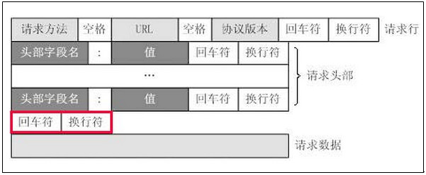
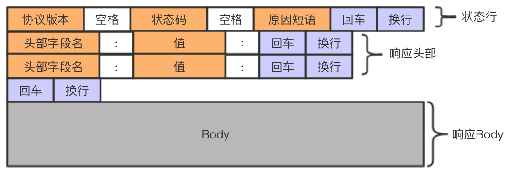
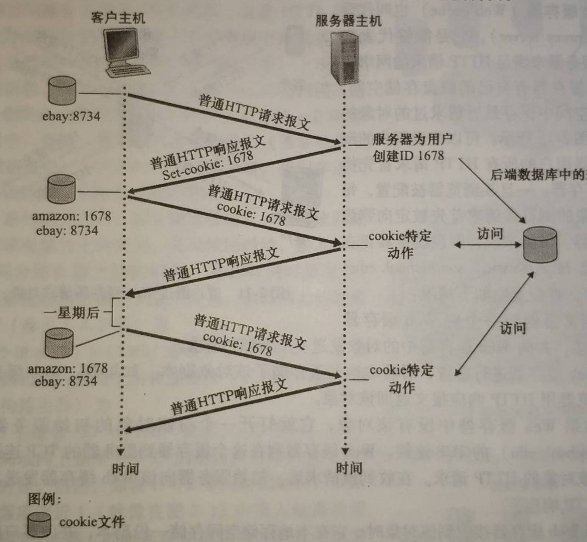

# 第2章 应用层

## 2.1 应用层协议原理

研发网络应用程序的核心是写出能够运行在不同的端系统和通过网络彼此通信的程序。

### 2.1.1 网络应用程序体系结构

从应用程序开发者的角度看，网络体系结构是固定的，并为应用程序提供了特定的服务集合。

#### 客户-服务器体系结构（client-server architecture）

* 有一个总是打开的主机称之为**服务器**向其他的被称为**客户**的主机提供服务。客户发起请求，服务器返回响应。
* 客户之间不直接通信。
* 服务器有固定的、周知的地址，称为IP地址。

单独的服务器通常不能满足所有客户请求，为此，配备大量主机的**数据中心**常被用于创建强大的虚拟服务器。

#### P2P体系结构（P2P architecture）

在P2P结构中，对位于数据中心的专用服务器有最小的（或者没有）依赖。相反，应用程序在间断连接的**主机对**之间直接使用通信，这些主机被称为**对等方**。

P2P体系结构最吸引人的特性之一是它的**自扩展性**。比如对于一个对等方而言，请求服务为网络整体增加了负担，但同时每个对等方返回响应也为网络增加服务能力。

### 2.1.2 进程通信

用操作系统的术语来说，进行通信的实际上是**进程**而不是程序。

在两个不同端系统上的进程，通过跨越计算机网络交换**报文**而相互通信。

#### 1. 客户和服务器进程

网络应用程序由成对的进程组成，这些进程通过网络相互发送报文。
没对通信进程，我们通常将者两个进程中的一个标识为客户，另一个标识为服务器。

我们定义客户和服务器进程如下：

>在一对进程之间的通信会话场景中，发起通信（即在该会话开始时发起与其他进程联系）的进程被标识为**客户**，在会话开始时等待联系的进程是**服务器**。

#### 2. 进程与计算机网络之间的接口

进程通过一个称为套接字的软件接口向网络发送报文和从网络接收报文。

#### 3. 进程寻址

接收进程需要有一个地址。

为了标识该接收进程，需要定义两种信息：

1. 主机的地址
   * 在因特网中，主机由其**IP地址**标识。
2. 在目的主机中指定接收进程的标识符
   * 目的地端口号用于这个目的。

### 2.1.3 可供应用程序使用的运输服务

一个运输层协议能够为调用它的应用程序提供什么样的服务呢？

我们大体能够从四个方面对应用程序服务要求进行分类：可靠数据传输、吞吐量、定时和安全性。

#### 1. 可靠数据传输

分组在计算机网络中可能丢失，因此，必须做一些工作以确保由应用程序的一端发送的数据正确、完全的交付给该应用程序的另一端。这就是**可靠数据传输**。

当一个运输层协议不能提供可靠数据传输时，这或许能被**容忍丢失的应用**所接收。比如在视频中有微小的干扰，这并非致命的损伤。

#### 2. 吞吐量

具有吞吐量要求的应用程序被称为**带宽敏感的应用**。比如因特网电话。

**弹性应用**则能够根据当时可用的贷款或多或少的利用可供使用的吞吐量。

#### 3. 定时

就是对延时做了规范

#### 4. 安全性

运输协议可以为应用程序提供一种或多种安全性服务。

### 2.1.4 因特网提供的运输服务

分为UDP和TCP

#### 1. TCP服务

TCP服务模型包括面向连接服务和可靠数据传输服务。

* **面向连接服务**：在应用层数据报文开始流动*之前*，TCP让客户和服务器互相交换运输层控制信息。这个所谓的握手过程提醒用户和服务器，让它们为大连分组的到来做好准备。在握手阶段后，一个**TCP连接**就在连个进程的套接字之间建立了。这条连接是全双工的，即连接双方的进程可以在此连接上同时进行报文收发。当应用程序结束报文发送时，必须拆除该连接。
* **可靠的数据传输服务**：通信进程能够依靠TCP，无差错、按适当顺序交付所有发送的数据。当应用程序的一端将字节流传进套接字时，它能够依靠TCP将相同的字节流交付给接收方的套接字，而没有字节的丢失和冗余。

TCP提供拥塞控制机制。

TCP可以使用SSL来提供安全服务。

#### 2. UDP服务

UDP是一种不提供不必要服务的轻量级运输协议，它仅提供最小服务。

UDP是无连接的，因此两个进程通信前没有握手过程。

UDP协议提供一种不可靠数据传送服务。

也就是说UDP不保证数据一定能传输到，即使传输到了，也有可能是乱序的，除此之外，UDP也没有拥塞控制机制。

#### 3. 因特网运输协议所不提供的服务

目前因特网运输协议中并没有提供吞吐量或定时的保证。

但我们仍能提供令人满意的服务，这是因为如因特网通话这样的应用在设计时就尽可能的应对了这种缺乏。

### 2.1.5 应用层协议

应用层协议定义了运行在不同端系统上的应用进程如何相互传递报文。特别是应用层协议定义了：

* 交换的报文类型，例如亲求报文和响应报文。
* 各种报文类型的语法，如报文中的各个字段及这些字段是如何描述的。
* 字段的语义，即这些字段中的信息的含义。
* 确定一个进程何时以及如何发送报文，对报文进行响应的规则。

有些应用层协议是由RFC文档定义的，如HTTP。

### 2.1.6 本书涉及的网络应用

Web、文件传输、电子邮件、目录服务、流式视频和P2P。

## 2.2 Web和Http

### 2.2.1 HTTP概况

HTTP是超文本传输协议(HyperText Transfer Protocol)，是Web的核心。

HTTP由两个程序实现：一个客户程序和一个服务器程序。HTTP定义了客户和服务器之间报文交换的方式。

Web页面由对象组成。一个**对象**就是一个文件，如图片，视频等。多数Web页面含有一个**HTML基本文件**。

HTML基本文件通过URL地址引用页面中的其他对象。每个URL分为两个部分：存放对象的服务器主机名和路径名。

Web浏览器就是常见的客户。

Web服务器实现了HTTP服务器端，用于存储Web对象。

HTTP定义了Web客户向Web服务器请求Web页面的方式，以及服务器向客户传送Web页面的方式。

HTTP使用TCP作为它的支撑运输协议。

客户和服务器通过套接字将报文从应用层传输到运输层。经过套接字后，发出报文的一端将报文的控制交给TCP，而接收报文的一端将控制权从TCP中接过。

服务器向客户发送被请求的文件，而不存储任何关于该客户的状态信息。所以我们说HTTP是一个**无状态协议**。假如某客户短时间内连续请求同一对象，服务器不会因为之前刚刚提供过这个对象而不做反应，而是重新发送该对象，就好像完全忘记之前做过的事一样。

### 2.2.2 非持续连接和持续连接

客户可能在一段时间内发出多个请求。

若每一个请求都经一个**单独**的TCP连接发送，则此应用程序使用**非持续连接**。

若这些请求都经**相同**的TCP连接发送，则称此应用程序使用**持续连接**。

在HTTP中默认使用持续连接。

#### 1. 采用非持续连接的HTTP

缺点：

1. 需要大量的TCP连接数，给服务器带来负担。
2. 每个对象都要经过三次握手，造成时延。

#### 2. 采用持续连接的HTTP

没什么特别的缺点。

### 2.2.3 HTTP报文格式

#### 1. HTTP请求报文

如下提供了一种典型的HTTP请求报文：

> GET /somedir/page.html HTTP/1.1
>
> Host: www.someschool.edu
>
> User-agent: Mozilla/5.0
>
> Accept-language: fr

请求报文格式：

```html
<method> <request-UTL> <version>
<headers>
<entity-body>
```



#### 2. HTTP响应报文

> HTTP/1.1 200 OK
>
> Connection: close
>
> Date: Tue, 18 Aug 2015 15:44:04 GMT
>
> Server: Apache/2.2.3 (CentOS)
>
> Last-Modified: Tue, 18 Aug 2015 15:11:03 GMT
>
> Content-Length: 6821
>
> Content-Type: text/html
>
> (data data data data data ...)



### 2.2.4 用户与服务器交互：cookie

Web站点用以识别用户的方法。

cookie技术有4个组件：

1. 在HTTP响应报文中的一个cookie首部行
2. 在HTTP请求报文中的一个cookie首部行
3. 在用户端系统中保留有一个cookie文件，并由用户的浏览器进行管理
4. 位于Web站点的一个后端数据库。



流程解释：

1. 第一次发起请求时，服务器会返回一个头，set-cookie: 0000
2. 浏览器将cookie设置到本地
3. 之后再发起请求就会使用之前设置好的cookie

### 2.2.5 Web缓存

**Web缓存器**也叫**代理服务器**，它是能够代表初始服务器来满足HTTP请求的网络实体。

当用户请求访问时，向代理服务器请求一个对象，若代理服务器没有该对象，将向初始服务器请求这个对象，并在代理服务器中保留副本。

这在客户到缓存器的带宽大于客户到服务器的带宽时，十分有效。

### 2.2.6 条件GET方法

Web缓存器虽然提高响应速度，但存放在缓存器中的对象副本可能时过时的。

不过，HTTP协议有一种机制，允许缓存器证实它的对象时最新的，这就是**条件GET**。

如果：

1. 请求报文

## 2.3 因特网中的电子邮件

### 2.3.1 SMTP

### 2.3.2 与HTTP对比

### 2.3.3 邮件报文格式

### 2.3.4 邮件访问协议

#### 1. POP3

#### 2. IMAP

#### 3. 基于Web的电子邮件

## 2.4 DNS：因特网的目录服务

### 2.4.1 DNS提供的服务

### 2.4.2 DNS工作机理概述

#### 1. 分布式、层次数据库

#### 2. DNS缓存

### 2.4.3 DNS记录和报文

#### 1. DNS报文

#### 2. 在DNS数据库中插入记录

## 2.5 P2P分发

### 1. P2P体系结构的扩展性

### 2. BitTorrent

## 2.6 视频流和内容分发网

### 2.6.1 因特网视频

### 2.6.2 HTTP流和DASH

### 2.6.3 内容分发网

#### 1. CDN操作

#### 2. 集群选择策略

### 2.6.4 学习案例：Netflix、Youtube和“看看”

#### 1. Netflix

#### 2. Youtube

#### 3. 看看

## 2.7 套接字编程：生成网络应用

### 2.7.1 UDP套接字编程

#### 1. UDPClient

#### 2. UDPServer

### TCP套接字编程

#### 1. TCPClient

#### 2. TCPServer

## 2.8 小结
